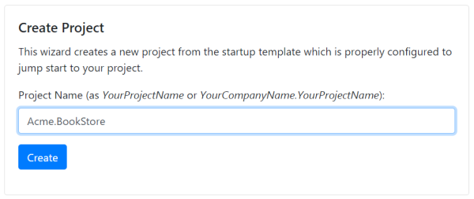

## ASP.NET Core MVC Template

### Creating a new project

Go to the template creation page, enter a project name and create your project as shown below:



When you click to the *create* button, a new Visual Studio solution is created and downloaded with the name you have provided.

### The Solution Structure

Open the zip file downloaded and open in **Visual Studio 2017 (15.7.0+)**:


The solution has a layered structure (based on Domain Driven Design) where;

* **.Domain** project is the domain layer.
* **.Application** project is the application layer.
* **.Web** project is the presentation layer.
* **.EntityFrameworkCore** project is the EF Core integration package.

The solution does also contain unit & integration test projects properly configured to work with **EF Core** & **SQLite in-memory** database.

### Creating the Database

Check the **connection string** in the **appsettings.json** file under the **.Web** project:

````json
{
  "ConnectionStrings": {
    "Default": "Server=localhost;Database=BookStore;Trusted_Connection=True"
  }
}
````

The solution is configured to use **Entity Framework Core** with **MS SQL Server** (EF Core supports [various](https://docs.microsoft.com/en-us/ef/core/providers/) database providers, so you can use another DBMS if you want).

Right click to the **.Web** project and select **Set as StartUp Project**:


Open the **Package Manager Console**, select **.EntityFrameworkCore** project as the **Default Project** and run the `Update-Database` command:


This will create a new database with the name configured.

### Running the Application

You can now run the application which will open the **home** page:


Click to the **Login** button, enter `admin` as the username and `1q2w3E*` as the password to login to the application.

Startup template includes the **identity management** module. Once you login, the Identity management menu will be available where you can manage **roles**, **users** and their **permissions**.


### What's Next?

* [Step by step application development tutorial for ASP.NET Core MVC](Tutorials/AspNetCore-Mvc/Part-I.md)