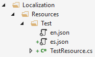

## Localization

ABP's localization system is built on top of the `Microsoft.Extensions.Localization` package and compatible with the [Microsoft's localization documentation](https://docs.microsoft.com/en-us/aspnet/core/fundamentals/localization).

### Volo.Abp.Localization Package

Volo.Abp.Localization is the core package of the localization system. Install it to your project using the package manager console (PMC):

```
Install-Package Volo.Abp.Localization
```

> This package is already installed by default with the startup template. So, most of the time, you don't need to install it manually.

Then you can add **AbpLocalizationModule** dependency to your module:

```c#
using Volo.Abp.Modularity;
using Volo.Abp.Localization;

namespace MyCompany.MyProject
{
    [DependsOn(typeof(AbpLocalizationModule))]
    public class MyModule : AbpModule
    {
        //...
    }
}
```

#### Creating A Localization Resource

A localization resource is used to group related localization strings together and separate them from other localization strings of the application. A module generally defines its own localization resource. Localization resource is just a plain class. Example:

````C#
public class TestResource
{
}
````

Then it should be added using `AbpLocalizationOptions` as shown below:

````C#
[DependsOn(typeof(AbpLocalizationModule))]
public class MyModule : AbpModule
{
    public override void ConfigureServices(IServiceCollection services)
    {
        services.Configure<VirtualFileSystemOptions>(options =>
        {
            options.FileSets.AddEmbedded<MyModule>();
        });

        services.Configure<AbpLocalizationOptions>(options =>
        {        
            options.Resources.AddVirtualJson<TestResource>(
                "en", 
                "/Localization/Resources/Test"
            );
        });
    }
}
````

In this example;

* Used JSON files to store the localization strings.
* JSON files are embedded into the assembly using the [virtual file system](Virtual-File-System.md).

JSON files are located under "/Localization/Resources/Test" project folder as shown below:



A JSON localization file content is shown below:

````json
{
  "culture": "en",
  "texts": {
    "HelloWorld": "Hello World!"
  }
}
````

* Every localization file should define the `culture` code for the file (like "en" or "en-US").
* `texts` section just contains key-value collection of the localization strings (keys may have spaces too).

##### Short Localization Resource Name

Localization resources are also available in the client (JavaScript) side. So, setting a short name for the localization resource makes it easy to use localization texts. Example:

````C#
[ShortLocalizationResourceName("Test")]
public class TestResource
{
}
````

See the Getting Localized Test / Client Side section below.

##### Inherit From Other Resources

A resource can inherit from other resources which makes possible to re-use existing localization strings without referring the existing resource. Example:

````C#
[InheritResource(typeof(AbpValidationResource))]
public class TestResource
{
}
````

Alternative inheritance by configuring the `AbpLocalizationOptions`:

````C#
services.Configure<AbpLocalizationOptions>(options =>
{
    options.Resources.AddVirtualJson<TestResource>("en", "/Localization/Resources/Test");

    //Inherit from an existing resource
    options.Resources.AddBaseTypes<TestResource>(typeof(AbpValidationResource));
});
````

* A resource may inherit from multiple resources.
* If the new resource defines the same localized string, it overrides the string.

##### Extending Existing Resource

Inheriting from a resource creates a new resource without modifying the existing one. In some cases, you may want to not create a new resource but directly extend an existing resource. Example:

````C#
services.Configure<AbpLocalizationOptions>(options =>
{
    options.Resources.ExtendWithVirtualJson<TestResource>(
        "/Localization/Resources/Test/Extensions"
    );
});
````

If an extension file defines the same localized string, it overrides the string.

#### Getting Localized Texts

##### Server Side

Getting the localized text on the server side is pretty standard. So, you can refer to the [Microsoft's localization documentation](https://docs.microsoft.com/en-us/aspnet/core/fundamentals/localization).

##### Client Side

TODO...