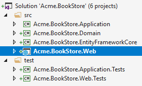

## ASP.NET Core MVC Tutorial - Part I

> This tutorial assumes that you have created a new project, named `Acme.BookStore` from [the startup templates](https://abp.io/Templates).

### About the Tutorial

In this tutorial series, you will build an application that is used to manage a list of books & their authors. **Entity Framework Core** (EF Core) will be used as the ORM provider (as it comes pre-configured with the startup template).

### Solution Structure

This is the layered solution structure created from the startup template:



### Create the Book Entity

Define [entities](../../Entities.md) in the **domain layer** (`Acme.BookStore.Domain` project) of the solution. The main entity of the application is the `Book`:

````C#
using System;
using System.ComponentModel.DataAnnotations;
using System.ComponentModel.DataAnnotations.Schema;
using Volo.Abp.Domain.Entities;

namespace Acme.BookStore
{
    [Table("Books")]
    public class Book : AggregateRoot<Guid>
    {
        [Required]
        [StringLength(128)]
        public string Name { get; set; }

        public BookType Type { get; set; }

        public DateTime PublishDate { get; set; }

        public float Price { get; set; }
    }
}
````

* ABP has two fundamental base classes for entities: `AggregateRoot` and `Entity`. **Aggregate Roots** are one of the concepts of the **Domain Driven Design (DDD)**. See [entity document](../../Entities.md) for details and best practices.
* Used **data annotation attributes** in this code. You could use EF Core's [fluent mapping API](https://docs.microsoft.com/en-us/ef/core/modeling) instead.

#### BookType Enum

The `BookType` enum used above is defined as below:

````C#
namespace Acme.BookStore
{
    public enum BookType : byte
    {
        Undefined,
        Advanture,
        Biography,
        Dystopia,
        Fantastic,
        Horror,
        Science,
        ScienceFiction,
        Poetry
    }
}
````

#### Add Book Entity to Your DbContext

EF Core requires to relate entities with your DbContext. The easiest way is to add a `DbSet` property to the `BookStoreDbContext` as shown below:

````C#
public class BookStoreDbContext : AbpDbContext<BookStoreDbContext>
{
    public DbSet<Book> Book { get; set; }
    ...
}
````

* `BookStoreDbContext` is located in the `Acme.BookStore.EntityFrameworkCore` project.

#### Add new Migration & Update the Database

Startup template uses [EF Core Code First Migrations](https://docs.microsoft.com/en-us/ef/core/managing-schemas/migrations/) to create and maintain the database schema. Open the **Package Manager Console (PMC)**, select the `Acme.BookStore.EntityFrameworkCore` as the **default project** and execute the following command:


This will create a new migration class inside the `Migrations` folder. Then execute the `Update-Database` command to update the database schema:

````
PM> Update-Database
````

#### Add Sample Data

`Update-Database` command created the `Books` table in the database. Enter a few sample rows, so you can show them on the page:


### Create the Application Service

The next step is to create an [application service](../../Application-Services.md) to manage (create, list, update, delete...) books.

TODO...