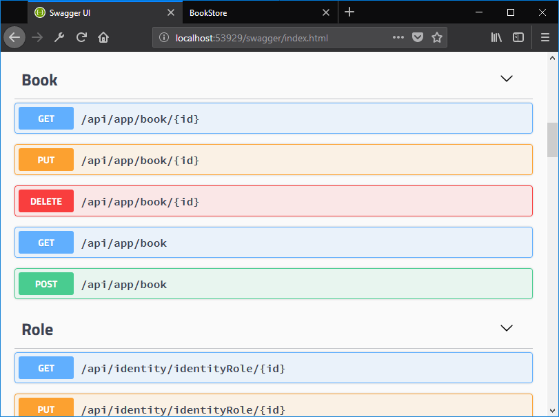
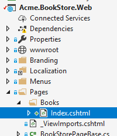
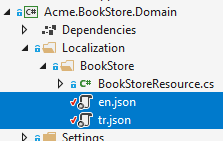
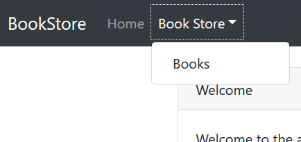
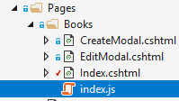
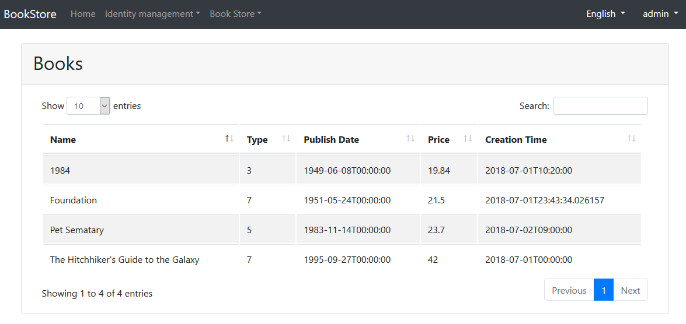

## ASP.NET Core MVC Tutorial - Part I

### About the Tutorial

In this tutorial series, you will build an application that is used to manage a list of books & their authors. **Entity Framework Core** (EF Core) will be used as the ORM provider (as it comes pre-configured with the [startup template](https://abp.io/Templates)).

This is the first part of the tutorial series. See all parts:

- **Part I: Create the project and a book list page (this tutorial)**
- [Part II: Create, Update and Delete books](Part-II.md)
- [Part III: Integration Tests](Part-III.md)

You can download the **source code** of the application [from here](https://github.com/volosoft/abp/tree/master/samples/BookStore).

### Creating the Project

Go to the [startup template page](https://abp.io/Templates) and download a new project named `Acme.BookStore`, create database and run the application by following the [template document](../../Getting-Started-AspNetCore-MVC-Template.md).

### Solution Structure

This is the layered solution structure created from the startup template:


### Create the Book Entity

Define [entities](../../Entities.md) in the **domain layer** (`Acme.BookStore.Domain` project) of the solution. The main entity of the application is the `Book`:

````C#
using System;
using System.ComponentModel.DataAnnotations;
using System.ComponentModel.DataAnnotations.Schema;
using Volo.Abp.Domain.Entities.Auditing;

namespace Acme.BookStore
{
    [Table("Books")]
    public class Book : AuditedAggregateRoot<Guid>
    {
        [Required]
        [StringLength(128)]
        public string Name { get; set; }

        public BookType Type { get; set; }

        public DateTime PublishDate { get; set; }

        public float Price { get; set; }
    }
}
````

* ABP has two fundamental base classes for entities: `AggregateRoot` and `Entity`. **Aggregate Root** is one of the **Domain Driven Design (DDD)** concepts. See [entity document](../../Entities.md) for details and best practices.
* `Book` entity inherits `AuditedAggregateRoot` which adds some auditing properties (`CreationTime`, `CreatorId`, `LastModificationTime`... etc.) on top of the `AggregateRoot` class.
* `Guid` is the **primary key type** of the `Book` entity.
* Used **data annotation attributes** in this code for EF Core mappings. You could use EF Core's [fluent mapping API](https://docs.microsoft.com/en-us/ef/core/modeling) instead.

#### BookType Enum

The `BookType` enum used above is defined as below:

````C#
namespace Acme.BookStore
{
    public enum BookType : byte
    {
        Undefined,
        Advanture,
        Biography,
        Dystopia,
        Fantastic,
        Horror,
        Science,
        ScienceFiction,
        Poetry
    }
}
````

#### Add Book Entity to Your DbContext

EF Core requires to relate entities with your DbContext. The easiest way is to add a `DbSet` property to the `BookStoreDbContext` class in the `Acme.BookStore.EntityFrameworkCore` project, as shown below:

````C#
public class BookStoreDbContext : AbpDbContext<BookStoreDbContext>
{
    public DbSet<Book> Book { get; set; }
    ...
}
````

#### Add New Migration & Update the Database

Startup template uses [EF Core Code First Migrations](https://docs.microsoft.com/en-us/ef/core/managing-schemas/migrations/) to create and maintain the database schema. Open the **Package Manager Console (PMC)** (under the *Tools/Nuget Package Manager* menu), select the `Acme.BookStore.EntityFrameworkCore` as the **default project** and execute the following command:


This will create a new migration class inside the `Migrations` folder. Then execute the `Update-Database` command to update the database schema:

````
PM> Update-Database
````

#### Add Sample Data

`Update-Database` command created the `Books` table in the database. Open your database and enter a few sample rows, so you can show them on the page:


### Create the Application Service

The next step is to create an [application service](../../Application-Services.md) to manage (create, list, update, delete...) the books.

#### BookDto

Create a DTO class named `BookDto` into the `Acme.BookStore.Application` project:

````C#
using System;
using Volo.Abp.Application.Dtos;
using Volo.Abp.AutoMapper;

namespace Acme.BookStore
{
    [AutoMapFrom(typeof(Book))]
    public class BookDto : AuditedEntityDto<Guid>
    {
        public string Name { get; set; }

        public BookType Type { get; set; }

        public DateTime PublishDate { get; set; }

        public float Price { get; set; }
    }
}
````

* **DTO** classes are used to **transfer data** between the *presentation layer* and the *application layer*. See the [Data Transfer Objects document](../../Data-Transfer-Objects.md) for details.
* `BookDto` is used to transfer a book data to the presentation layer to show a book information on the UI.
* `BookDto` is derived from the `AuditedEntityDto<Guid>` which has audit properties just like the `Book` defined above.
* `[AutoMapFrom(typeof(Book))]` is used to create AutoMapper mapping from the `Book` class to the `BookDto` class. Thus, you can automatically convert `Book` objects to `BookDto` objects (instead of manually copy all properties).

#### CreateUpdateBookDto

Create a DTO class named `CreateUpdateBookDto` into the `Acme.BookStore.Application` project:

````c#
using System;
using System.ComponentModel.DataAnnotations;
using Volo.Abp.AutoMapper;

namespace Acme.BookStore
{
    [AutoMapTo(typeof(Book))]
    public class CreateUpdateBookDto
    {
        [Required]
        [StringLength(128)]
        [Display(Name = "Name")]
        public string Name { get; set; }

        [Display(Name = "Type")]
        public BookType Type { get; set; } = BookType.Undefined;

        [Display(Name = "PublishDate")]
        public DateTime PublishDate { get; set; }

        [Display(Name = "Price")]
        public float Price { get; set; }
    }
}
````

* This DTO class is used to get book information from the user interface while creating or updating a book.
* It defines data annotation attributes (like `[Required]`) to define validations for the properties. DTOs are automatically validated by ABP.
* Each property has a `[Display]` property which set the label text on UI forms for the related input (it's also integrated to the localization system). The same DTO will be used as View Model. That's why it defines that attribute. You may find incorrect to use DTOs as View Models. You could use a separated view model class, but we thought it's practical and makes the sample project less complex.

#### IBookAppService

Define an interface named `IBookAppService` for the book application service:

````C#
using System;
using Volo.Abp.Application.Dtos;
using Volo.Abp.Application.Services;

namespace Acme.BookStore
{
    public interface IBookAppService : 
        IAsyncCrudAppService< //Defines CRUD methods
            BookDto, //Used to show books
            Guid, //Primary key of the book entity
            PagedAndSortedResultRequestDto, //Used for paging/sorting on getting a list of books
            CreateUpdateBookDto, //Used to create a new book
            CreateUpdateBookDto> //Used to update a book
    {

    }
}
````

* Defining interfaces for application services is <u>not required</u> by the framework. However, it's suggested as a good practice.
* `IAsyncCrudAppService` defines common **CRUD** methods: `GetAsync`, `GetListAsync`, `CreateAsync`, `UpdateAsync` and `DeleteAsync`. It's not required to extend it. Instead, you could inherit from the empty `IApplicationService` interface and define your own methods.
* There are some variations of the `IAsyncCrudAppService` where you can use a single DTO or separated DTOs for each method.

#### BookAppService

Implement the `IBookAppService` as named `BookAppService`:

````C#
using System;
using Volo.Abp.Application.Dtos;
using Volo.Abp.Application.Services;
using Volo.Abp.Domain.Repositories;

namespace Acme.BookStore
{
    public class BookAppService : 
        AsyncCrudAppService<Book, BookDto, Guid, PagedAndSortedResultRequestDto,
                            CreateUpdateBookDto, CreateUpdateBookDto>,
        IBookAppService
    {
        public BookAppService(IRepository<Book, Guid> repository) 
            : base(repository)
        {

        }
    }
}
````

* `BookAppService` is derived from `AsyncCrudAppService<...>` which implements all CRUD methods defined above.
* `BookAppService` injects `IRepository<Book, Guid>` which is the default repository created for the `Book` entity. ABP automatically creates repositories for each aggregate root (or entity). See the [repository document](../../Repositories.md).
* `BookAppService` uses `IObjectMapper` to convert `Book` objects to `BookDto` objects and `CreateUpdateBookDto` objects to `Book` objects. Startup template uses the [AutoMapper](http://automapper.org/) library as object mapping provider. You defined mappings using the `AutoMapFrom` and the `AutoMapTo` attributes above. See the [AutoMapper integration document](../../AutoMapper-Integration.md) for details.

### Auto API Controllers

You normally create **Controllers** to expose application services as **HTTP API** endpoints. Thus, browser or 3rd-party clients can call via AJAX.

ABP can **automagically** configures your application services as MVC API Controllers by convention.

#### Swagger UI

The startup template is configured to run the [swagger UI](https://swagger.io/tools/swagger-ui/) using the [Swashbuckle.AspNetCore](https://github.com/domaindrivendev/Swashbuckle.AspNetCore) library. Run the application and enter `http://localhost:53929/swagger/` as URL on your browser.

You will see some built-in service endpoints as well as the `Book` service and its REST-style endpoints:



### Dynamic JavaScript Proxies

It's common to call HTTP API endpoints via AJAX from the **JavaScript** side. You can use `$.ajax` or another tool to call the endpoints. However, ABP offers a better way.

ABP **dynamically** creates JavaScript **proxies** for all API endpoints. So, you can use any **endpoint** just like calling a **JavaScript function**.

#### Testing in the Browser Developer Console

You can just test the JavaScript proxy using your favorite browser's **Developer Console** now. Run the application again, open your browser's **developer tools** (shortcut: F12), switch to the **Console** tab, type the following code and press enter:

````js
acme.bookStore.book.getList({}).done(function (result) { console.log(result); });
````

* `acme.bookStore` is the namespace of the `BookAppService` converted to [camelCase](https://en.wikipedia.org/wiki/Camel_case).
* `book` is the conventional name for the `BookAppService` (removed AppService postfix and converted to camelCase).
* `getList` is the conventional name for the `GetListAsync` method defined in the `AsyncCrudAppService` base class (removed Async postfix and converted to camelCase).
* `{}` argument is used to send an empty object to the `GetListAsync` method which normally expects an object of type `PagedAndSortedResultRequestDto` which is used to send paging and sorting options to the server.
* `getList` function returns a `promise`. So, you can pass a callback to the `done` (or `then`) function to get the result from the server.

Running this code produces such an output:


You can see the **book list** returned from the server. You can also check the **network** tab of the developer tools to see the client to server communication:


Let's **create a new book** using the `create` function:

````js
acme.bookStore.book.create({ name: 'Foundation', type: 7, publishDate: '1951-05-24', price: 21.5 }).done(function (result) { console.log('successfully created the book with id: ' + result.id); });
````

You should see a message in the console something like that:

````
successfully created the book with id: f3f03580-c1aa-d6a9-072d-39e75c69f5c7
````

Check the `books` table in the database to see the new book row. You can try `get`, `update` and `delete` functions too.

### Create the Books Page

It's time to create something visible and usable! Instead of classic MVC, we will use the new [Razor Pages UI](https://docs.microsoft.com/en-us/aspnet/core/tutorials/razor-pages/razor-pages-start) approach which is recommended by Microsoft.

Create a new `Books` folder under the `Pages` folder of the `Acme.BookStore.Web` project and add a new Razor Page named `Index.html`:



Open the `Index.cshtml` and change the content as shown below:

````html
@page
@using Acme.BookStore.Pages.Books
@inherits Acme.BookStore.Pages.BookStorePageBase
@model IndexModel

<h2>Books</h2>
````

* This page **inherits** from the `BookStorePageBase` class which comes with the startup template and provides some shared properties/methods used by all pages.

#### Add Books Page to the Main Menu

Open the `BookStoreMenuContributor` class in the `Menus` folder and add the following code to the end of the `ConfigureMainMenuAsync` method:

````c#
context.Menu.AddItem(
    new ApplicationMenuItem("BooksStore", l["Menu:BookStore"])
        .AddItem(new ApplicationMenuItem("BooksStore.Books", l["Menu:Books"], url: "/Books"))
);
````

#### Localizing the Menu Items

Localization texts are located under the `Localization/BookStore` folder of the `Acme.BookStore.Domain` project:



Open the `en.json` file and add localization texts for `Menu:BookStore` and `Menu:Books`  keys:

````json
{
  "culture": "en",
  "texts": {
    //...
    "Menu:BookStore": "Book Store",
    "Menu:Books": "Books"
  }
}
````

* ABP's localization system is built on [ASP.NET Core's standard localization](https://docs.microsoft.com/en-us/aspnet/core/fundamentals/localization) system and extends it in many ways. See the [localization document](../../Localization.md) for details.
* Localization key names are arbitrary, you can set any name. We prefer to add `Menu` namespace for menu items to distinguish from other texts. If a text is not defined in the localization file, it **fallbacks** to the localization key (ASP.NET Core's standard behavior).

Run the application and see the menu items are added to the top bar:



When you click to the Books menu item, you are redirected to the new Books page.

#### Book List

We will use the [Datatables.net](https://datatables.net/) JQuery plugin to show list of tables on the page. Datatables completely works via AJAX, so it is fast and provides a good user experience. Datatables plugin is configured in the startup template, so you can directly use it.

##### Index.cshtml Changes

Change the `Pages/Books/Index.cshtml` as following:

````html
@page
@using Acme.BookStore.Pages.Books
@inherits Acme.BookStore.Pages.BookStorePageBase
@model IndexModel
@section scripts
{
    <abp-script src="/pages/books/index.js" />
}
<abp-card>
    <abp-card-header>
        <h2>@L["Books"]</h2>
    </abp-card-header>
    <abp-card-body>
        <abp-table striped-rows="true" id="BooksTable">
            <thead>
                <tr>
                    <th>@L["Name"]</th>
                    <th>@L["Type"]</th>
                    <th>@L["PublishDate"]</th>
                    <th>@L["Price"]</th>
                    <th>@L["CreationTime"]</th>
                </tr>
            </thead>
        </abp-table>
    </abp-card-body>
</abp-card>
````

* `abp-script` [tag helper](https://docs.microsoft.com/en-us/aspnet/core/mvc/views/tag-helpers/intro) is used to add external **scripts** to the page. It has many additional features compared to standard `script` tag. It handles **minification** and **versioning** for example. See the [bundling & minification document](../../AspNetCore/Bundling-Minification.md) for details.
* `abp-card` and `abp-table` are **tag helpers** for Twitter Bootstrap's [card component](http://getbootstrap.com/docs/4.1/components/card/). There are many tag helpers in ABP to easily use most of the [bootstrap](https://getbootstrap.com/) components. You can use regular HTML tags instead of these tag helpers, but using tag helpers reduces HTML code and prevents errors by the help of the intellisense. See the [tag helpers document](../../AspNetCore/Tag-Helpers.md).
* You can **localize** the column names in the localization file as you did for the menu items above.

##### Add a Script File

Create `index.js` JavaScript file under the `wwwroot/pages/books/` folder:



`index.js` content is shown below:

````js
$(function() {
    var dataTable = $('#BooksTable').DataTable({
        ajax: abp.libs.datatables.createAjax(acme.bookStore.book.getList),
        columnDefs: [
            {
                targets: 0,
                data: "name"
            },
            {
                targets: 1,
                data: "type"
            },
            {
                targets: 2,
                data: "publishDate"
            },
            {
                targets: 3,
                data: "price"
            },
            {
                targets: 4,
                data: "creationTime"
            }
        ]
    });
});
````

* `abp.libs.datatables.createAjax` is a helper function to adapt ABP's dynamic JavaScript API proxies to Datatable's format.
* `acme.bookStore.book.getList` is the function to get list of books (you have seen it before).
* See [Datatable's documentation](https://datatables.net/manual/) for more configuration options.

The final UI is shown below:



### Next Part

See the [next part](Part-II.md) of this tutorial.