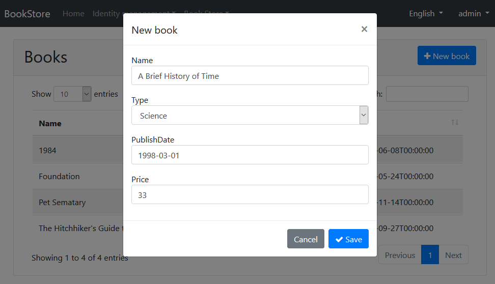
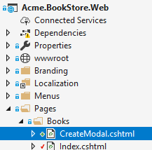
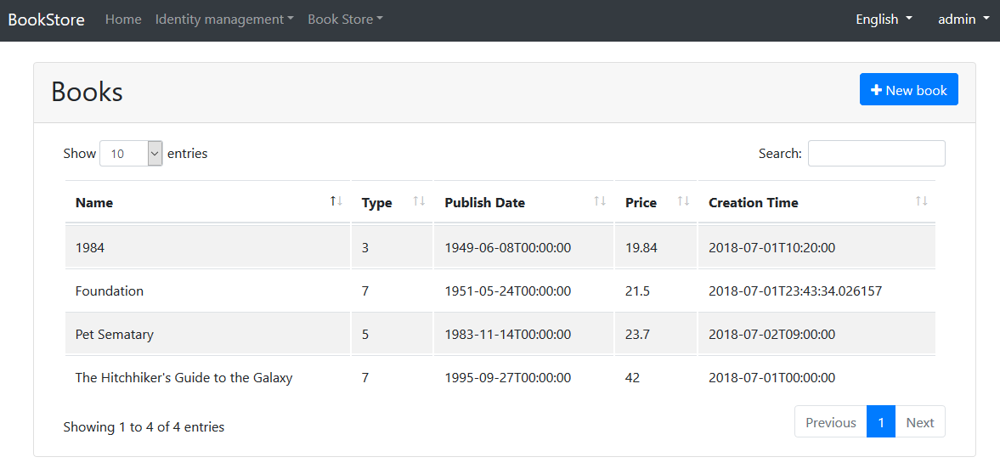

## ASP.NET Core MVC Tutorial - Part II

### About the Tutorial

In this tutorial series, you will build an application that is used to manage a list of books & their authors. **Entity Framework Core** (EF Core) will be used as the ORM provider (as it comes pre-configured with the startup template).

This is the second part of the tutorial series. See all parts:

* [Part I: Create the project and a book list page](Part-I.md)
* **Part II: Create, Update and Delete books (this tutorial)**
* [Part III: Integration Tests](Part-III.md)

You can download the **source code** of the application [from here](https://github.com/volosoft/abp/tree/master/samples/BookStore).

### Creating a New Book

In this section, you will learn how to create a new modal dialog form to create a new book. The result dialog will be like that:



#### Create the Modal Form

Create a new razor page, named `CreateModal.cshtml` under the `Pages/Books` folder of the `Acme.BookStore.Web` project:



##### CreateModal.cshtml.cs

Open the `CreateModal.cshtml.cs` file (`CreateModalModel` class) and replace with the following code:

````C#
using System;
using System.ComponentModel.DataAnnotations;
using System.Threading.Tasks;
using Microsoft.AspNetCore.Mvc;
using Volo.Abp.AspNetCore.Mvc.UI.RazorPages;

namespace Acme.BookStore.Pages.Books
{
    public class CreateModalModel : AbpPageModel
    {
        [BindProperty]
        public CreateBookViewModel Book { get; set; }

        private readonly IBookAppService _bookAppService;

        public CreateModalModel(IBookAppService bookAppService)
        {
            _bookAppService = bookAppService;
        }

        public async Task<IActionResult> OnPostAsync()
        {
            ValidateModel();

            var bookDto = ObjectMapper.Map<CreateBookViewModel, BookDto>(Book);
            await _bookAppService.CreateAsync(bookDto);

            return NoContent();
        }

        public class CreateBookViewModel
        {
            [Required]
            [StringLength(128)]
            [Display(Name = "Name")]
            public string Name { get; set; }

            [Display(Name = "Type")]
            public BookType Type { get; set; } = BookType.Undefined;

            [Display(Name = "PublishDate")]
            public DateTime PublishDate { get; set; }

            [Display(Name = "Price")]
            public float Price { get; set; }
        }
    }
}
````

* `CreateBookViewModel` is a nested class that will be used to create and post the form.
  * Each property has a `[Display]` property which sets the label on the form for the related input. It's also integrated to the localization system.
  * Each property has data annotations for validation which is used for validation in the client side and the server side and automatically localized.
* `[BindProperty]` attribute on the `Book` property binds post request data to this property.

##### AutoMapper Configuration

`OnPostAsync` method maps `CreateBookViewModel` object to `BookDto` object (which is accepted by the `BookAppService.CreateAsync` method).

Open the `BookStoreWebAutoMapperProfile` class and add the mapping:

````C#
using Acme.BookStore.Pages.Books;
using AutoMapper;
using Volo.Abp.AutoMapper;

namespace Acme.BookStore
{
    public class BookStoreWebAutoMapperProfile : Profile
    {
        public BookStoreWebAutoMapperProfile()
        {
            CreateMap<CreateModalModel.CreateBookViewModel, BookDto>()
                .Ignore(x => x.Id);
        }
    }
}

````

Thus, AutoMapper will create the mapping configuration between classes and will ignore the `Id` property of the `BookDto` class (to satisfy the configuration validation - see below).

##### AutoMapper Configuration Validation

AutoMapper has a [configuration validation feature](http://automapper.readthedocs.io/en/latest/Configuration-validation.html) which is not enabled for the startup template by default. If you want to perform validation, go to the `BookStoreWebModule` class, find the `ConfigureAutoMapper` method and change the `AddProfile` line as shown below:

````c#
options.AddProfile<BookStoreWebAutoMapperProfile>(validate: true);
````

It's up to you to use validation or not. It can prevent mapping mistakes, but comes with a cost of configuration. See [AutoMapper's documentation](http://automapper.readthedocs.io/en/latest/Configuration-validation.html) to fully understand it.

##### CreateModal.cshtml

Open the `CreateModal.cshtml` file and paste the code below:

````html
@page
@inherits Acme.BookStore.Pages.BookStorePageBase
@using Volo.Abp.AspNetCore.Mvc.UI.Bootstrap.TagHelpers.Modal
@model Acme.BookStore.Pages.Books.CreateModalModel
@{
    Layout = null;
}
<abp-dynamic-form abp-model="Book" data-ajaxForm="true" asp-page="/Books/CreateModal">
    <abp-modal>
        <abp-modal-header title="@L["NewBook"].Value"></abp-modal-header>
        <abp-modal-body>
            <abp-form-content />
        </abp-modal-body>
        <abp-modal-footer buttons="@(AbpModalButtons.Cancel|AbpModalButtons.Save)">
        </abp-modal-footer>
    </abp-modal>
</abp-dynamic-form>
````

* This modal uses `abp-dynamic-form` tag helper to automatically create the form from the `CreateBookViewModel` class.
  * `abp-model` attribute indicates the model object, the `Book` in this case.
  * `data-ajaxForm` attribute makes the form to submit via AJAX, instead of classic page post.
  * `abp-form-content` tag helper is a placeholder to render the form. This is optional and needed only if you added some other content in the `abp-dynamic-form` tag.

#### Add the "New book" Button

Open the `Pages/Books/Index.cshtml` and change the `abp-card-header` tag as shown below:

````html
<abp-card-header>
    <abp-row>
        <abp-column size-md="_6">
            <h2>@L["Books"]</h2>
        </abp-column>
        <abp-column size-md="_6" class="text-right">
            <abp-button id="NewBookButton"
                        text="@L["NewBook"].Value"
                        icon="plus"
                        button-type="Primary" />
        </abp-column>
    </abp-row>
</abp-card-header>
````

Just added a **New book** button to the **top right** of the table:



Open the `wwwroot/pages/books/index.js` and add the following code just after the datatable configuration:

````js
var createModal = new abp.ModalManager(abp.appPath + 'Books/CreateModal');

createModal.onResult(function () {
    dataTable.ajax.reload();
});

$('#NewBookButton').click(function (e) {
    e.preventDefault();
    createModal.open();
});
````

* `abp.ModalManager` is a helper class to open and manage modals in the client side. It internally uses Twitter Bootstrap's standard modal, but abstracts many details by providing a simple API.

Now, you can **run the application** and add new books using the new modal form.

### Updating An Existing Book

TODO...