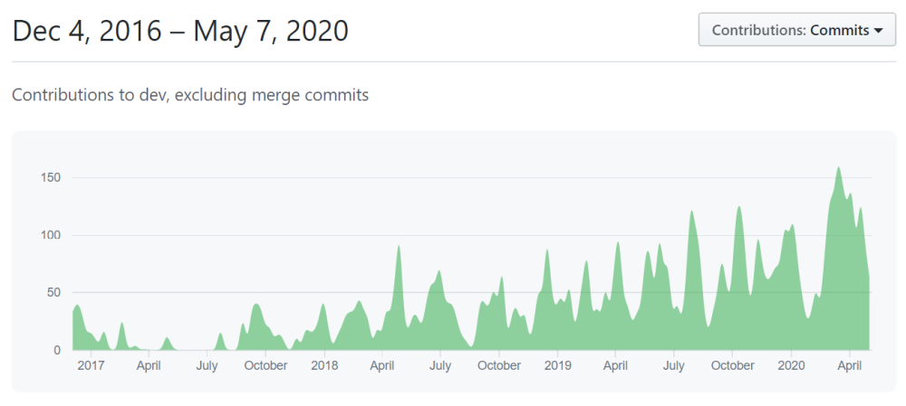
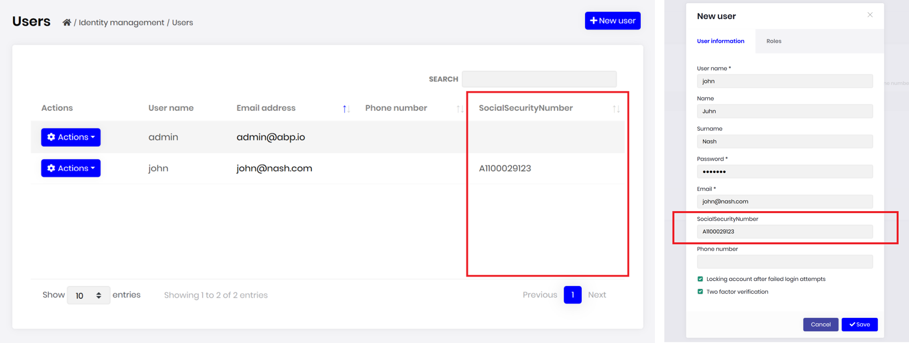

# ABP Framework v2.7.0 Has Been Released!

The **ABP Framework** & and the **ABP Commercial** v2.7 have been released. We hadn't created blog post for   the 2.4, 2.4 and 2.6 releases, so this post will also cover **what's new** with these releases and **what we've done** in the last 2 months.

## About the Release Cycle & Development

Reminding that we had started to release a new minor feature version **in every two weeks**, generally on Thursdays. Our goal is to deliver new features as soon as possible.

We've completed & merged hundreds of issues and pull requests with **1,300+ commits** in the last 7-8 weeks, only for the ABP Framework repository. Daily commit counts are constantly increasing:



ABP.IO Platform is rapidly growing and we are getting more and more contributions from the community.

## What's New in the ABP Framework?

### Object Extending System

In the last few releases, we've mostly focused on providing ways to extend existing modules when you use them as NuGet/NPM Packages. 

The Object Extending System allows module developers to create extensible modules and allows application developers to customize and extend a module easily.

For example, you can add two extension properties to the user entity of the identity module:

````csharp
ObjectExtensionManager.Instance
    .AddOrUpdate<IdentityUser>(options =>
        {
            options.AddOrUpdateProperty<string>("SocialSecurityNumber");
            options.AddOrUpdateProperty<bool>("IsSuperUser");
        }
    );
````

It is easy to define validation rules for the properties:

````csharp
ObjectExtensionManager.Instance
    .AddOrUpdateProperty<IdentityUserCreateDto, string>(
        "SocialSecurityNumber",
        options =>
        {
            options.Attributes.Add(new RequiredAttribute());
            options.Attributes.Add(
                new StringLengthAttribute(32) {
                    MinimumLength = 6 
                }
            );
        });
````

You can even write custom code to validate the property. It automatically works for the objects those are parameters of an application service, controller or a page.

While extension properties of an entity are normally stored in a single JSON formatted field in the database table, you can easily configure to store a property as a table field using the EF Core mapping:

````csharp
ObjectExtensionManager.Instance
    .AddOrUpdateProperty<IdentityUser, string>(
        "SocialSecurityNumber",
        options =>
        {
            options.MapEfCore(b => b.HasMaxLength(32));
        }
    );
````

See the [Object Extensions document](https://docs.abp.io/en/abp/latest/Object-Extensions) for details about this system.

See also the [Customizing the Existing Modules](https://docs.abp.io/en/abp/latest/Customizing-Application-Modules-Guide) guide to learn all the possible customization options.

### Text Templating Package

[Volo.Abp.TextTemplating](https://www.nuget.org/packages/Volo.Abp.TextTemplating) is a new package introduced with the v2.7.0. Previously, [Volo.Abp.Emailing](https://www.nuget.org/packages/Volo.Abp.Emailing) package had a similar functionality but it was limited, experimental and tightly coupled to the emailing.

The new text templating package allows you to define text based templates those can be easily localized and reused. You can define layout templates and share the layout from other templates.

We are currently using it for email sending. A module needs to send an email typically defines a template. Example:

````xml
<h3>{{L "PasswordReset"}}</h3>

<p>{{L "PasswordResetInfoInEmail"}}</p>

<div>
    <a href="{{model.link}}">{{L "ResetMyPassword"}}</a>
</div>
````

This is a typical password reset email template.

* The template system is based on the open source [Scriban library](https://github.com/lunet-io/scriban). So it supports if conditions, loops and much more.
* `model` is used to pass data to the template (just like the ASP.NET Core MVC).
* `L` is a special function that localizes the given string.

It is typical to use the same layout for all emails. So, you can define a layout template. This is the standard layout template comes with the framework:

````xml
<!DOCTYPE html>
<html lang="en" xmlns="http://www.w3.org/1999/xhtml">
<head>
    <meta charset="utf-8" />
</head>
<body>
    {{content}}
</body>
</html>
````

A layout should have a `{{content}}` area to render the child content (just like the `RenderBody()` in the MVC).

It is very easy to override a template content by the final application to customize it.

Whenever you need to render a template, use the `ITemplateRenderer` service by providing the template name and a model. See the [text templating documentation](https://docs.abp.io/en/abp/latest/Text-Templating) for details. We've even created a UI for the ABP Commercial (see the related section below).

### Subscribing to the Exceptions

ABP Framework's [exception handling system](https://docs.abp.io/en/abp/latest/Exception-Handling) automatically handles exceptions and returns an appropriate result to the client. In some cases, you may want to have a callback that is notified whenever an exception occurs. In this way, for example, you can send an email or take any action based on the exception.

Just create a class derived from the `ExceptionSubscriber` class in your application:

````csharp
public class MyExceptionSubscriber : ExceptionSubscriber
{
    public override async Task HandleAsync(ExceptionNotificationContext context)
    {
        //TODO...
    }
}
````

See the [exception handling](https://docs.abp.io/en/abp/latest/Exception-Handling) document for more.

### Others

There are many minor features and enhancements made to the framework in the past releases. Here, a few ones:

* Added `AbpLocalizationOptions.DefaultResourceType` to set the default resource type for the application. In this way, the localization system uses the default resource whenever the resource was not specified. The latest application startup template already configures it, but you may want to set it for your existing applications.
* Added `IsEnabled` to permission definition. In this way, you can completely disable a permission and hide the related functionality from the application. This can be a way of feature switch for some applications. See [#3486](https://github.com/abpframework/abp/issues/3486) for usage.
* Added Dutch and German localizations to all the localization resources defined by the framework. Thanks to the contributors.

## What's New in the ABP Commercial

The goal of the [ABP Commercial](https://commercial.abp.io/) is to provide pre-build application functionalities, code generation tools, professional themes, advanced samples and premium support for ABP Framework based projects.

We are working on the ABP Commercial in the parallel to align with the ABP Framework features and provide more modules, theme options and tooling.

This section explains what's going on the ABP Commercial side.

### Module Entity Extension System

Module entity extension system is a higher level API that uses the object extension system (introduced above) and provides an easy way to add extension properties to existing entities. A new extension property easily automatically becomes a part of the HTTP API and the User Interface.

Example: Add a `SocialSecurityNumber` to the user entity of the identity module

````csharp
ObjectExtensionManager.Instance.Modules()
    .ConfigureIdentity(identity =>
    {
        identity.ConfigureUser(user =>
        {
            user.AddOrUpdateProperty<string>( //property type: string
                "SocialSecurityNumber", //property name
                property =>
                {
                    //validation rules
                    property.Attributes.Add(new RequiredAttribute());
                    property.Attributes.Add(
                        new StringLengthAttribute(64) {
                            MinimumLength = 4
                        }
                    );

                    //...other configurations for this property
                }
            );
        });
    });
````

With just such a configuration, the user interface will have the new property (on the table and on the create/edit forms):



The new property can be easily localized and validated. Currently, it supports primitive types like string, number and boolean, but we planned to add more advanced scenarios by the time (like navigation/lookup properties).

See the [Module Entity Extensions](https://docs.abp.io/en/commercial/latest/guides/module-entity-extensions) guide to learn how to use it and configure details.

#### Other Extension Points

There are also some other pre-defined points to customize and extend the user interface of a depended module:

* You can add a new action for an entity on the data table (left side on the picture below).
* You can add new buttons (or other controls) to the page toolbar (right side on the picture below).
* You can add custom columns to a data table.


See the [Customizing the Modules](https://docs.abp.io/en/commercial/latest/guides/customizing-modules) guide to learn all the possible ways to customize a depended module.

