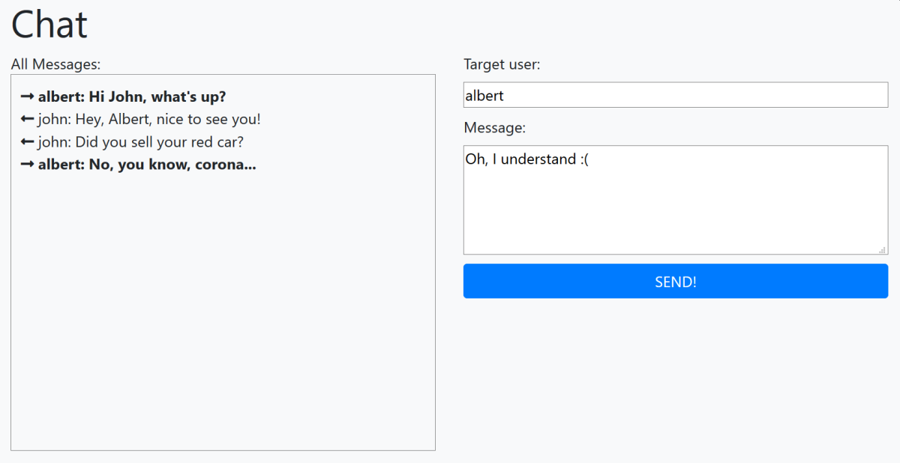
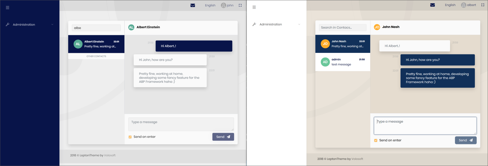

# ABP v2.8.0 Releases & Road Maps

The **ABP Framework** & and the **ABP Commercial** v2.8 have been released. This post will cover **what's new** with these releases and the **middle-term road maps** for the projects.

## What's New in the ABP Framework 2.8?

You can see all the changes on the [GitHub release notes](https://github.com/abpframework/abp/releases/tag/2.8.0). This post will only cover the important features/changes.

### SignalR Integration Package

We've published [a new package](https://www.nuget.org/packages/Volo.Abp.AspNetCore.SignalR) to integrate SignalR to ABP framework based applications.

> It is already possible to follow [the standard Microsoft tutorial](https://docs.microsoft.com/en-us/aspnet/core/tutorials/signalr) to add [SignalR](https://docs.microsoft.com/en-us/aspnet/core/signalr/introduction) to your application. However, ABP provides a SignalR integration packages those simplify the integration and usage. 

See the [SignalR Integration document](https://docs.abp.io/en/abp/latest/SignalR-Integration) to start with the SignalR.

#### SignalR Demo Application

We've also created a simple chat application to demonstrate how to use it.



See [the source code of the application.](https://github.com/abpframework/abp-samples/tree/master/SignalRDemo)

### Console Application Startup Template

The new console application template can be used to create a new console application that has the ABP Framework integrated.

Use ABP CLI to create a new console application, specifying the `console` as the `-t` (template) option:

````bash
abp new MyApp -t console
````

Thanks to the contribution of [@liangshiw](https://github.com/liangshiw) for this template.

### RTL Support for the MVC UI & Arabic Localization

[@kgamalseif](https://github.com/kgamalseif) has contributed a RTL implementation for the MVC UI which looks pretty fine:


He also localized all the framework and module resources. Thanks to him for this great contribution.

### Others

Some other highlights from this release:

* Converted HttpApi.Client packages of the modules to .netstandard 2.0 to be compatible with other kind of applications.
* Improved the object extensibility system to better handle UI, localization and validation.
* Implemented disabling background job execution for HangFire & Quartz intergrations.
* New JsTree integration package for the MVC UI.
* Moved all samples to the new [abp-samples](https://github.com/abpframework/abp-samples) repository and created an [index page](https://docs.abp.io/en/abp/latest/Samples/Index) to see all.

### Deprecations

* Deprecated the `app.UseMvcWithDefaultRouteAndArea()` and introduced the `app.UseConfiguredEndpoints()` (see [#3880](https://github.com/abpframework/abp/issues/3880)).
* Deprecated the `UsePostgreSql()` and introduced the `UseNpgsql()` for the [Volo.Abp.EntityFrameworkCore.PostgreSql](http://nuget.org/packages/Volo.Abp.EntityFrameworkCore.PostgreSql) package. Switch to `UseNpgsql()` if you are using PostgreSQL.

Old methods are marked as `Obsolete` and will be removed in the next major versions.

## What's New in the ABP Commercial 2.8?

### The New Lepton Theme

We've completely revised [the lepton theme](https://commercial.abp.io/themes). See with different styles:


Example screenshots from the language management page of the ABP Commercial:


(Default style UI)


(Material style UI)

[Create a demo](https://commercial.abp.io/demo) to test all the styles in live. You can change the style from the settings page.

### The New Chat Module

The first version of [the chat module](https://commercial.abp.io/modules/Volo.Chat) has been released with this version. It has only the MVC / Razor Pages UI. Angular UI is on the way.



It currently has a simple **real time text messaging** functionality. More features like group messaging, sending images/files are on the road map.

### Others

* Implemented [module entity extension](https://docs.abp.io/en/commercial/latest/guides/module-entity-extensions) system for the Angular UI. Also improved the system to better handle float/double/decimal, date, datetime, enum and boolean properties.
* Managing product groups on a tree view for the [EasyCRM sample application](https://docs.abp.io/en/commercial/latest/samples/easy-crm).

## About the Next Versions

We publish feature releases in **every 2 weeks**. So, the planned date of the next feature version is **June 04** and the version number is **2.9**. This (probably) will be the **last 2.x version** and the following version will be **3.0**.

### ABP Framework 2.9 & 3.0

#### Organization Unit System

Organization Unit system for the Identity module was intended to be released with 2.8, but unfortunately we couldn't be sure about the stability of the feature, so deferred it to the 2.9.

#### gRPC

We planned to work on a gRPC integrated example application. Then we will plan to create gRPC endpoints for all [pre-built modules](https://docs.abp.io/en/abp/latest/Modules/Index) and to [the startup templates](https://docs.abp.io/en/abp/latest/Startup-Templates/Index). We want to use these endpoints with the new planned [Blazor](https://docs.microsoft.com/en-us/aspnet/core/blazor/) UI option (there is a [huge demand](https://github.com/abpframework/abp/issues/394) on a Blazor UI, we know). It doesn't mean that we'll finish the whole work in 3.0, but we are starting and will continue in 3.0+ versions.

#### Oracle with EF Core

We see that the people using Oracle with EF Core has some pains, independent from the ABP Framework. Because there is no stable & free Oracle provider for EF Core 3.1 yet. We only see the [Devart](https://www.devart.com/) has created a [paid package](https://www.nuget.org/packages/Devart.Data.Oracle.EFCore).

[@ebicoglu](https://github.com/ebicoglu) has [created a gist](https://gist.github.com/ebicoglu/9f364c7eff9d87315af0178866186401) to demonstrate how to use it. We [planned](https://github.com/abpframework/abp/issues/3983) to work on an integration package to make it even easier.

#### API Documentation

We are [working](https://github.com/abpframework/abp/issues/1184) to create an API documentation for the framework and build a CD pipeline to automatically publish it in every new release. This will make easier to explore the framework classes.

#### Sample Application: Using SignalR on a Tiered/Distributed system

Using SignalR on a distributed/microservice system can be tricky since the services are not connected to clients and can not directly call client functions from the server. One way to overcome this problem is using a distributed message bus (like RabbitMQ) that transfers the message from the service to the web application to deliver to the client.

We will create an example application and document it to demonstrate such an architecture and how it is easy by using the ABP Framework.

While this topic is not directly related to the ABP Framework and the problem is not unique to an ABP based application, we find useful to create such guides to developers.

#### And...

We will spend more time to write more documentation, implement performance improvements, make more tests, creating more extensibility points and so on.

### ABP Commercial 2.9 & 3.0

#### Organization Unit Management UI

In parallel to the OU system in the ABP Framework (mentioned above), we are creating a UI to manage the organization units, which will be released with the 2.9.

#### Angular UI for the Chat Module

The Chat Module (mentioned above) only has the ASP.NET Core MVC / Razor Pages UI now. We are working to create the Angular UI for this module.

#### New Module Idea: File Management

We are looking to create a File Management Module that is used to manage (upload/download) and share files between users. You may think as a very simple and lightweight Google Drive :).

#### Easy CRM Angular UI

[Easy CRM](https://docs.abp.io/en/commercial/latest/samples/easy-crm) is a sample application we've released with the previous version of the ABP Commercial. In this version, we've added more features to this application. In the next version, we will work on the Angular UI for it.

We found this application very useful since it is very close to a real world application compared to the simple [BookStore](https://docs.abp.io/en/commercial/latest/samples/index#book-store) example.

#### And...

We are working to improve current [modules](https://commercial.abp.io/modules), [themes](https://commercial.abp.io/themes) and the [tooling](https://commercial.abp.io/tools) to provide a more comfortable developer experience with the version 3.0.

## The Road Map

We are frequently asked about the road map of the [ABP Framework](https://abp.io/) and the [ABP Commercial](https://commercial.abp.io/). While we've answered to it in various platforms, with this release, we've adding road map pages for these products to their documentation:

* ABP Framework Road Map
* ABP Commercial Road Map

I am also writing the road map here, in the following sections;

### ABP Framework Road Map

TODO

### ABP Commercial Road Map

TODO