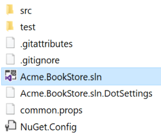
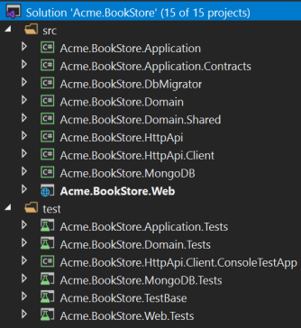
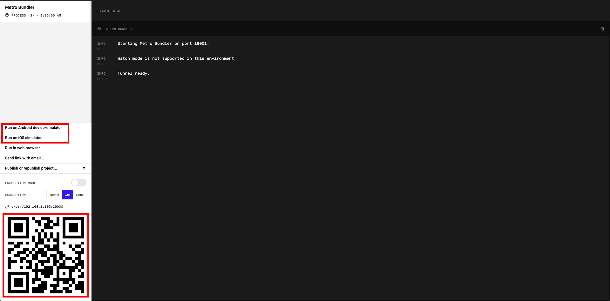

# Getting started

````json
//[doc-params]
{
    "UI": ["MVC","NG"],
    "DB": ["EF", "Mongo"],
    "Tiered": ["Yes", "No"]
}
````

This tutorial explains how to create a new {{if UI == "MVC"}} ASP.NET Core MVC web {{else if UI == "NG"}} Angular {{end}} application using the startup template, configure and run it.


## Setup your development environment

First things first! Let's setup your development environment before creating the first project.

### Pre-requirements

The following tools should be installed on your development machine:

* [Visual Studio 2019 (v16.4+)](https://visualstudio.microsoft.com/vs/) for Windows / [Visual Studio for Mac](https://visualstudio.microsoft.com/vs/mac/).
* [.NET Core 3.0+](https://www.microsoft.com/net/download/dotnet-core/)

* [Node v12+](https://nodejs.org)
* [Yarn v1.19+](https://classic.yarnpkg.com/)
{{ if Tiered == "Yes" }}

* [Redis](https://redis.io/): The applications use Redis as as [distributed cache](../Caching.md). So, you need to have Redis installed & running.

{{ end }}


> You can use another editor instead of Visual Studio as long as it supports .NET Core and ASP.NET Core.

### Install the ABP CLI

[ABP CLI](./CLI.md) is a command line interface that is used to authenticate and automate some tasks for ABP based applications.

> ABP CLI is a free & open source tool for [the ABP framework](https://abp.io/).

First, you need to install the ABP CLI using the following command:

````shell
dotnet tool install -g Volo.Abp.Cli
````

If you've already installed, you can update it using the following command:

````shell
dotnet tool update -g Volo.Abp.Cli
````

## Create a new project

> This document assumes that you prefer to use **{{ UI_Value }}** as the UI framework and **{{ DB_Value }}** as the database provider. For other options, please change the preference on top of this document.

### Using the ABP CLI to create a new project

Use the `new` command of the ABP CLI to create a new project:

````shell
abp new Acme.BookStore -t app{{if UI == "NG"}} -u angular {{end}}{{if DB == "Mongo"}} -d mongodb{{end}}{{if Tiered == "Yes" && UI != "NG"}} --tiered {{else if Tiered == "Yes" && UI == "NG"}}--separate-identity-server{{end}}
````

* `-t` argument specifies the [startup template](Startup-Templates/Application.md) name. `app` is the startup template that contains the essential [ABP Modules](Modules/Index.md) pre-installed and configured for you.

{{ if UI == "NG" }}

* `-u` argument specifies the UI framework, `angular` in this case.

{{ if Tiered == "Yes" }}

* `--separate-identity-server` argument is used to separate the identity server application from the API host application. If not specified, you will have a single endpoint.

{{ end }}

{{ end }}

{{ if DB == "Mongo" }}

* `-d` argument specifies the database provider, `mongodb` in this case.

{{ end }}

{{ if Tiered == "Yes" && UI != "NG" }}

* `--tiered` argument is used to create N-tiered solution where authentication server, UI and API layers are physically separated.

{{ end }}

> You can use different level of namespaces; e.g. BookStore, Acme.BookStore or Acme.Retail.BookStore. 

#### ABP CLI commands & options

[ABP CLI document](./CLI.md) covers all of the available commands and options for the ABP CLI. See the [ABP Startup Templates](Startup-Templates/Index.md) document for other templates.

## The solution structure

{{ if UI == "MVC" }}

After creating your project, you will have the following solution folders & files:



You will see the following solution structure when you open the `.sln` file in the Visual Studio:

{{if DB == "Mongo"}}



{{else}}


{{end}}

{{ else if UI == "NG" }}
There are three folders in the created solution:


* `angular` folder contains the Angular UI application.
* `aspnet-core` folder contains the backend solution.
* `react-native` folder contains the React Native UI application.

Open the `.sln` (Visual Studio solution) file under the `aspnet-core` folder:


{{ end }}

> ###### About the projects in your solution
>
> Your solution may have slightly different structure based on your **UI**, **database** and other preferences.

The solution has a layered structure (based on [Domain Driven Design](./Domain-Driven-Design.md)) and also contains unit & integration test projects.

{{ if DB == "EF" }}

Integration tests projects are properly configured to work with **EF Core** & **SQLite in-memory** database.

{{ else if DB == "Mongo" }}

Integration tests projects are properly configured to work with in-memory **MongoDB** database created per test (used [Mongo2Go](https://github.com/Mongo2Go/Mongo2Go) library).

{{ end }}

> See the [application template document](Startup-Templates/Application.md) to understand the solution structure in details. 

## Create the database

### Database connection string

Check the **connection string** in the `appsettings.json` file under the {{if UI == "MVC"}}{{if Tiered == "Yes"}}`.IdentityServer` and `.HttpApi.Host` projects{{else}}`.Web` project{{end}}{{else if UI == "NG" }}`.HttpApi.Host` project{{end}}:

{{ if DB == "EF" }}

````json
"ConnectionStrings": {
  "Default": "Server=localhost;Database=BookStore;Trusted_Connection=True"
}
````

The solution is configured to use **Entity Framework Core** with **MS SQL Server**. EF Core supports [various](https://docs.microsoft.com/en-us/ef/core/providers/) database providers, so you can use any supported DBMS. See [the Entity Framework integration document](https://docs.abp.io/en/abp/latest/Entity-Framework-Core) to learn how to switch to another DBMS.

### Apply the migrations

The solution uses the [Entity Framework Core Code First Migrations](https://docs.microsoft.com/en-us/ef/core/managing-schemas/migrations/?tabs=dotnet-core-cli). So, you need to apply migrations to create the database. There are two ways of applying the database migrations.

#### Apply migrations using the DbMigrator

The solution comes with a `.DbMigrator` console application which applies migrations and also seed the initial data. It is useful on development as well as on production environment.

> `.DbMigrator` project has its own `appsettings.json`. So, if you have changed the connection string above, you should also change this one. 

Right click to the `.DbMigrator` project and select **Set as StartUp Project**


 Hit F5 (or Ctrl+F5) to run the application. It will have an output like shown below:

 

> Initial seed data creates the `admin` user in the database which is then used to login to the application. So, you need to use `.DbMigrator` at least once for a new database.

#### Using EF Core Update-Database command

Ef Core has `Update-Database` command which creates database if necessary and applies pending migrations.

{{ if UI == "MVC" }}

Right click to the {{if Tiered == "Yes"}}`.IdentityServer`{{else}}`.Web`{{end}} project and select **Set as StartUp project**: 

{{ else if UI != "MVC" }}

Right click to the `.HttpApi.Host` project and select **Set as StartUp Project**: 

{{ end }}


Open the **Package Manager Console**, select `.EntityFrameworkCore.DbMigrations` project as the **Default Project** and run the `Update-Database` command:


This will create a new database based on the configured connection string.

> Using the `.Migrator` tool is the suggested way, because it also seeds the initial data to be able to properly run the web application. 

{{ else if DB == "Mongo" }}

````json
"ConnectionStrings": {
  "Default": "mongodb://localhost:27017/BookStore"
}
````

The solution is configured to use **MongoDB** in your local computer, so you need to have a MongoDB server instance up and running or change the connection string to another MongoDB server.

### Seed initial data

The solution comes with a `.DbMigrator` console application which seeds the initial data. It is useful on development as well as on production environment.

> `.DbMigrator` project has its own `appsettings.json`. So, if you have changed the connection string above, you should also change this one. 

Right click to the `.DbMigrator` project and select **Set as StartUp Project**


 Hit F5 (or Ctrl+F5) to run the application. It will have an output like shown below:

 

> Initial seed data creates the `admin` user in the database which is then used to login to the application. So, you need to use `.DbMigrator` at least once for a new database.

{{ end }}

## Run the application

{{ if UI == "MVC" }}

{{ if Tiered == "Yes" }}

Ensure that the `.IdentityServer` project is the startup project. Run the application which will open a **login** page in your browser.

> Use Ctrl+F5 in Visual Studio (instead of F5) to run the application without debugging. If you don't have a debug purpose, this will be faster.

You can login, but you cannot enter to the main application here. This is just the authentication server.

Ensure that the `.HttpApi.Host` project is the startup project and run the application which will open a **Swagger UI** in your browser.


This is the API application that is used by the web application.

Lastly, ensure that the `.Web` project is the startup project and run the application which will open a **welcome** page in your browser


Click to the **login** button which will redirect you to the `Identity Server` to login to the application:


{{ else }}

Ensure that the `.Web` project is the startup project. Run the application which will open the **login** page in your browser:

> Use Ctrl+F5 in Visual Studio (instead of F5) to run the application without debugging. If you don't have a debug purpose, this will be faster.


{{ end }}

{{ else if UI != "MVC" }}

#### Running the HTTP API Host (server-side)

{{ if Tiered == "Yes" }}

Ensure that the `.IdentityServer` project is the startup project. Run the application which will open a **login** page in your browser.

> Use Ctrl+F5 in Visual Studio (instead of F5) to run the application without debugging. If you don't have a debug purpose, this will be faster.

You can login, but you cannot enter to the main application here. This is just the authentication server.

{{ end }}

Ensure that the `.HttpApi.Host` project is the startup project and run the application which will open a Swagger UI:

{{ if Tiered == "No" }}

> Use Ctrl+F5 in Visual Studio (instead of F5) to run the application without debugging. If you don't have a debug purpose, this will be faster.

{{ end }}


You can see the application APIs and test them here. Get [more info](https://swagger.io/tools/swagger-ui/) about the Swagger UI.

> ##### Authorization for the Swagger UI
>
> Most of the HTTP APIs require authentication & authorization. If you want to test authorized APIs, manually go to the `/Account/Login` page, enter `admin` as the username and `1q2w3E*` as the password to login to the application. Then you will be able to execute authorized APIs too.

{{ end }}

{{ if UI == "NG" }}
#### Running the Angular application (client-side)

Go to the `angular` folder, open a command line terminal, type the `yarn` command (we suggest to the [yarn](https://yarnpkg.com/) package manager while `npm install` will also work in most cases)

```bash
yarn
```

Once all node modules are loaded, execute `yarn start` (or `npm start`) command:

```bash
yarn start
```

Wait `Angular CLI` to launch `Webpack` dev-server with `BrowserSync`. 
This will take care of compiling your `TypeScript` code, and automatically reloading your browser. 
After it finishes, `Angular Live Development Server` will be listening on localhost:4200, 
open your web browser and navigate to [localhost:4200](http://localhost:4200/)


{{ end }}

Enter **admin** as the username and **1q2w3E*** as the password to login to the application:


The application is up and running. You can start developing your application based on this startup template.

#### Mobile Development

ABP platform provide [React Native](https://reactnative.dev/) template to develop mobile applications.

>The solution includes the React Native application in the `react-native` folder as default. If you don't plan to develop a mobile application with React Native, you can ignore this step and delete the `react-native` folder.

The React Native application running on an Android emulator or a physical phone cannot connect to the backend on `localhost`. To fix this problem, it is necessary to run backend on the local IP.

{{ if Tiered == "No"}}


* Open the `appsettings.json` in the `.HttpApi.Host` folder. Replace the `localhost` address on the `SelfUrl` and `Authority` properties with your local IP address.
* Open the `launchSettings.json` in the `.HttpApi.Host/Properties` folder. Replace the `localhost` address on the `applicationUrl` properties with your local IP address.

{{ else if Tiered == "Yes" }}


* Open the `appsettings.json` in the `.IdentityServer` folder. Replace the `localhost` address on the `SelfUrl` property with your local IP address.
* Open the `launchSettings.json` in the `.IdentityServer/Properties` folder. Replace the `localhost` address on the `applicationUrl` properties with your local IP address.
* Open the `appsettings.json` in the `.HttpApi.Host` folder. Replace the `localhost` address on the `Authority` property with your local IP address.
* Open the `launchSettings.json` in the `.HttpApi.Host/Properties` folder. Replace the `localhost` address on the `applicationUrl` properties with your local IP address.

{{ end }}

Run the backend as described in the [**Running the HTTP API Host (server-side)**](#running-the-http-api-host-server-side) section.

> React Native application does not trust the auto-generated .NET HTTPS certificate, you should use the HTTP during development.

Go to the `react-native` folder, open a command line terminal, type the `yarn` command (we suggest to the [yarn](https://yarnpkg.com/) package manager while `npm install` will also work in most cases):

```bash
yarn
```

* Open the `Environment.js` in the `react-native` folder and replace the `localhost` address on the `apiUrl` and `issuer` properties with your local IP address as shown below:


{{ if Tiered == "Yes" }}

> Make sure that `issuer` matches the running address of the `.IdentityServer` project, `apiUrl` matches the running address of the `.HttpApi.Host` project.

{{else}}

> Make sure that `issuer` and `apiUrl` matches the running address of the `.HttpApi.Host` project.

{{ end }}

Once all node modules are loaded, execute `yarn start` (or `npm start`) command:

```bash
yarn start
```

Wait Expo CLI to start. Expo CLI opens the management interface on the `http://localhost:19002/` address.



In the above management interface, you can start the application with an Android emulator, an iOS simulator or a physical phone by the scan the QR code with the [Expo Client](https://expo.io/tools#client).

> See the [Android Studio Emulator](https://docs.expo.io/versions/v36.0.0/workflow/android-studio-emulator/), [iOS Simulator](https://docs.expo.io/workflow/ios-simulator/) documents on expo.io.


Enter **admin** as the username and **1q2w3E*** as the password to login to the application.

The application is up and running. You can continue to develop your application based on this startup template.

> The [application startup template](Startup-Templates/Application.md) includes the TenantManagement and Identity modules.

## What's next?

[Application development tutorial](Tutorials/Part-1.md)
