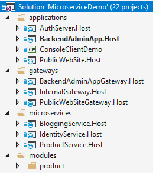
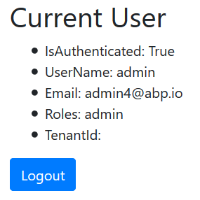
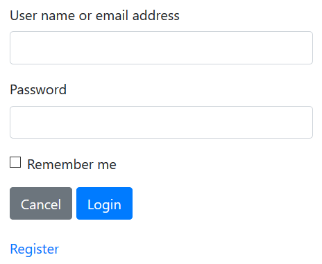

# Microservice Demo Solution

*"Microservices are a software development technique—a variant of the **service-oriented architecture** (SOA) architectural style that structures an application as a collection of **loosely coupled services**. In a microservices architecture, services are **fine-grained** and the protocols are **lightweight**. The benefit of decomposing an application into different smaller services is that it improves **modularity**. This makes the application easier to understand, develop, test, and become more resilient to architecture erosion. It **parallelizes development** by enabling small autonomous teams to **develop, deploy and scale** their respective services independently. It also allows the architecture of an individual service to emerge through **continuous refactoring**. Microservices-based architectures enable **continuous delivery and deployment**."*

— [Wikipedia](https://en.wikipedia.org/wiki/Microservices)

## Introduction

One of the major goals of the ABP framework is to provide a [convenient infrastructure to create microservice solutions](../Microservice-Architecture.md).

This sample aims to demonstrate a simple yet complete microservice solution;

* Has multiple, independent, self-deployable **microservices**.
* Multiple **web applications**, each uses a different API gateway.
* Has multiple **gateways** / BFFs (Backend for Frontends) developed using the [Ocelot](https://github.com/ThreeMammals/Ocelot) library.
* Has an **authentication service** developed using the [IdentityServer](https://identityserver.io/) framework. It's also a SSO (Single Sign On) application with necessary UIs.
* Has **multiple databases**. Some microservices has their own database while some services/applications shares a database (to demonstrate different use cases).
* Has different types of databases: **SQL Server** (with **Entity Framework Core** ORM) and **MongoDB**.
* Has a **console application** to show the simplest way of using a service by authenticating.
* Uses [Redis](https://redis.io/) for **distributed caching**.
* Uses [RabbitMQ](https://www.rabbitmq.com/) for service-to-service **messaging**.
* Uses [Docker](https://www.docker.com/) & [Kubernates](https://kubernetes.io/) to **deploy** & run all services and applications.
* Uses [Elasticsearch](https://www.elastic.co/products/elasticsearch) & [Kibana](https://www.elastic.co/products/kibana) to store and visualize the logs (written using [Serilog](https://serilog.net/)).

The diagram below shows the system:


### Source Code

You can get the source code from [the GitHub repository](https://github.com/abpframework/abp/tree/master/samples/MicroserviceDemo).

### Status

This sample is still in development, not completed yet.

## Running the Solution

You can either run from the **source code** or from the pre-configured **docker-compose** file.

### Using the Docker Containers

#### Pre Requirements

Running as docker containers is easier since all dependencies are pre-configured. You only need to install the [latest docker](https://docs.docker.com/compose/install/).

#### Running Containers

- Clone or download the [ABP repository](https://github.com/abpframework/abp).

- Open a command line in the `samples/MicroserviceDemo` folder of the repository.

- Restore SQL Server databases:

  ```
  docker-compose -f docker-compose.yml -f docker-compose.migrations.yml run restore-database
  ```

- Start the containers:

  ```
  docker-compose up -d
  ```

  At the first run, it will take a **long time** because it will build all docker images.

- Add this line to the end of your `hosts` file:

  ```
  127.0.0.1	auth-server
  ```

  hosts file is located inside the `C:\Windows\System32\Drivers\etc\hosts` folder on Windows and `/etc/hosts` for Linux/MacOS.

#### Run the Applications

There are a few applications running in the containers you may want to explore:

* Backend Admin Application (BackendAdminApp.Host): `http://localhost:51512`
  *(Used to manage users & products in the system)*
* Public Web Site (PublicWebsite.Host): `http://localhost:51513`
  *(Used to list products and run/manage the blog module)*
* Authentication Server (AuthServer.Host): `http://auth-server:51511/`
  *(Used as a single sign on and authentication server built with IdentityServer4)*
* Kibana UI: `http://localhost:51510`
  *(Use to show/trace logs written by all services/applications/gateways)*

### Running From the Source Code

#### Pre Requirements

To be able to run the solution from source code, following tools should be installed and running on your computer:

* [SQL Server](https://www.microsoft.com/en-us/sql-server/sql-server-downloads) 2015+ (can be [express edition](https://www.microsoft.com/en-us/sql-server/sql-server-editions-express))
* [Redis](https://redis.io/download) 5.0+
* [RabbitMQ](https://www.rabbitmq.com/install-windows.html) 3.7.11+
* [MongoDB](https://www.mongodb.com/download-center) 4.0+
* [ElasticSearch](https://www.elastic.co/downloads/elasticsearch) 6.6+
* [Kibana](https://www.elastic.co/downloads/kibana) 6.6+ (optional, recommended to show logs)

#### Open & Build the Visual Studio Solution

* Open the `samples\MicroserviceDemo\MicroserviceDemo.sln` in Visual Studio 2017 (15.9.0+).
* Run `dotnet restore` from the command line inside the `samples\MicroserviceDemo` folder.
* Build the solution in Visual Studio.

#### Restore Databases

Open `MsDemo_Identity.zip` and `MsDemo_ProductManagement.zip` inside the `samples\MicroserviceDemo\databases` folder and restore to the SQL Server.

> Notice that: These databases have EF Core migrations in the solution, however they don't have seed data, especially required for IdentityServer4 configuration. So, restoring the databases is much more easier.

#### Run Projects

Run the projects with the following order (right click to each project, set as startup project an press Ctrl+F5 to run without debug):

* AuthServer.Host
* IdentityService.Host
* BloggingService.Host
* ProductService.Host
* InternalGateway.Host
* BackendAdminAppGateway.Host
* PublicWebSiteGateway.Host
* BackendAdminApp.Host
* PublicWebSite.Host

## A Brief Overview of the Solution

The Visual Studio solution consists of multiple projects each have different roles in the system:



### Applications

These are the actual applications those have user interfaces to interact to the users and use the system.

- **AuthServer.Host**: Host the IdentityServer4 to provide an authentication service to other services and applications. It is a single-sign server and contains the login page.
- **BackendAdminApp.Host**: This is a backend admin application that host UI for Identity and Product management modules.
- **PubicWebSite.Host**: As public web site that contains a simple product list page and blog module UI.
- **ConsoleClientDemo**: A simple console application to demonstrate the usage of services from a C# application.

### Gateways / BFFs (Backend for Frontend)

Gateways are used to provide a single entry point to the applications. It can also used for rate limiting, load balancing... etc. Used the [Ocelot](https://github.com/ThreeMammals/Ocelot) library.

* **BackendAdminAppGateway.Host**: Used by the BackendAdminApp.Host application as backend.
* **PublicWebSiteGateway.Host**: Used by the PublicWebSite.Host application as backend.
* **InternalGateway.Host**: Used for inter-service communication (the communication between microservices).

### Microservices

Microservices have no UI, but exposes some REST APIs.

- **IdentityService.Host**: Host the ABP Identity module which is used to manage users & roles. It has no additional service, but only hosts the Identity module's API.
- **BloggingService.Host**: Host the ABP Blogging module which is used to manage blog & posts (a typical blog application). It has no additional service, but only hosts the Blogging module's API.
- **ProductService.Host**: Hosts the Product module (that is inside the solution) which is used to manage products. It also contains the EF Core migrations to create/update the Product Management database schema.

### Modules

* **Product**: A layered module that is developed with the [module development best practices](../Best-Practices/Index.md). It can be embedded into a monolithic application or can be hosted as a microservice by separately deploying API and UI (as done in this demo solution).

### Databases

This solution is using multiple databases:

* **MsDemo_Identity**: An SQL database. Used **SQL Server** by default, but can be any DBMS supported by the EF Core. Shared by AuthServer and IdentityService. Also audit logs, permissions and settings are stored in this database (while they could easily have their own databases, shared the same database to keep it simple).
* **MsDemo_ProductManagement**: An SQL database. Again, used **SQL Server** by default, but can be any DBMS supported by the EF Core. Used by the ProductService as a dedicated database.
* **MsDemo_Blogging**: A **MongoDB** database. Used by the BloggingService.
* **Elasticsearch**: Used to write logs over Serilog.

## Applications

### Authentication Server (AuthServer.Host)

This project is used by all other services and applications for authentication & single sign on. Mainly, uses **IdentityServer4** to provide these services. It uses some of the [pre-build ABP modules](../Modules/Index) like *Identity*, *Audit Logging* and *Permission Management*.

#### Database & EF Core Configuration

This application uses a SQL database (named it as **MsDemo_Identity**) and maintains its schema via **Entity Framework Core migrations.**

It has a DbContext named **AuthServerDbContext** and defined as shown below:

````csharp
public class AuthServerDbContext : AbpDbContext<AuthServerDbContext>
{
    public AuthServerDbContext(DbContextOptions<AuthServerDbContext> options) 
        : base(options)
    {

    }

    protected override void OnModelCreating(ModelBuilder modelBuilder)
    {
        base.OnModelCreating(modelBuilder);

        modelBuilder.ConfigureIdentity();
        modelBuilder.ConfigureIdentityServer();
        modelBuilder.ConfigureAuditLogging();
        modelBuilder.ConfigurePermissionManagement();
        modelBuilder.ConfigureSettingManagement();
    }
}
````

In the **OnModelCreating**, you see **ConfigureX()** method calls. A module with a database schema generally declares such an extension method to configure EF Core mappings for its own entities. This is a flexible approach where you can arrange your databases and modules inside them; You can use a different database for each module, or combine some of them in a shared database. In the AuthServer project, we decided to combine multiple module schemas in a single EF Core DbContext, in a single physical database. These modules are Identity, IdentityServer, AuditLogging, PermissionManagement and SettingManagement modules.

#### User Interface

AuthServer has a simple home page that shows the current user info if the current user has logged in:



It also provides Login & Register pages:



These pages are not included in the project itself. Instead, AuthServer project uses the prebuilt ABP [account module](https://github.com/abpframework/abp/tree/master/modules/account) with IdentityServer extension. That means it can also act as an OpenId Connect server with necessary UI and logic.

#### Other Dependencies

* **RabbitMQ** for messaging to other services.
* **Redis** for distributed/shared caching.

### Backend Admin Application (BackendAdminApp.Host)

TODO

## Microservices

### Identity Service

TODO

## Infrastructure

TODO

### Messaging

### Caching

### Logging

### Correlation Id