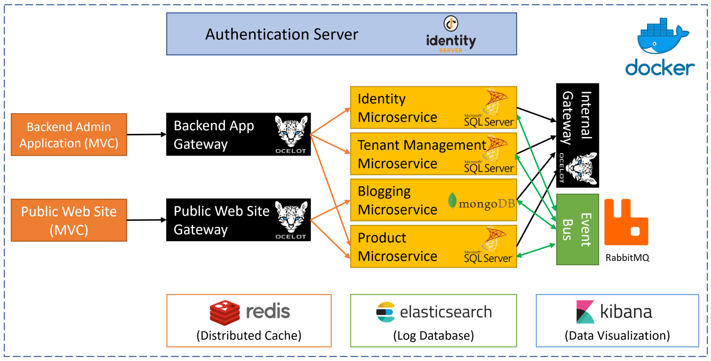
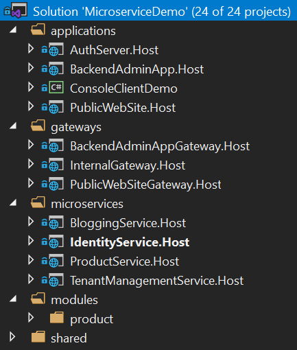
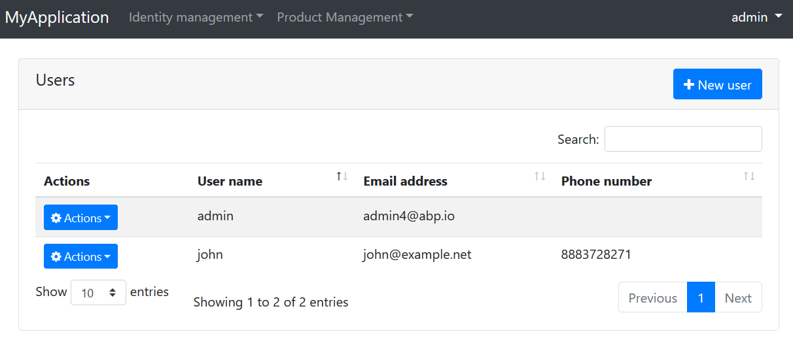
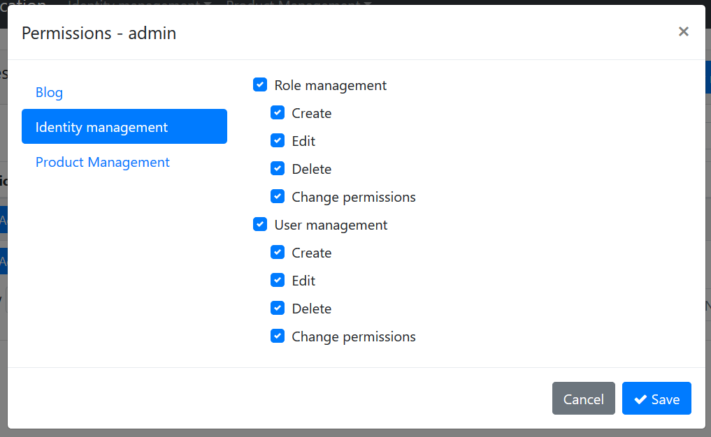
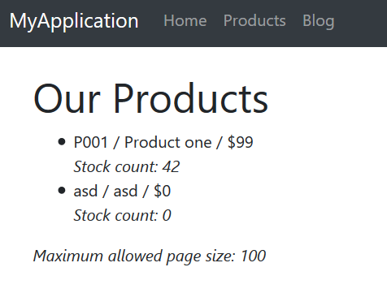
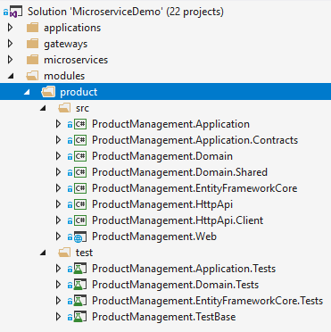
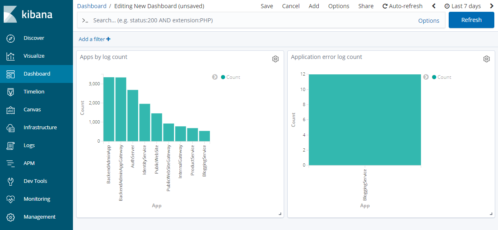
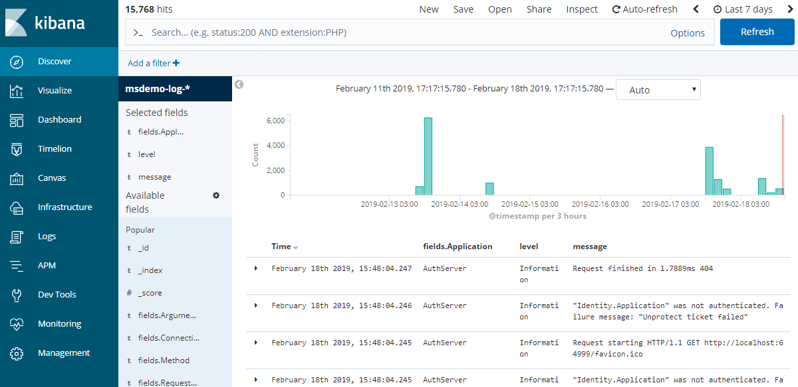

# Microservice Demo Solution

*"Microservices are a software development technique—a variant of the **service-oriented architecture** (SOA) architectural style that structures an application as a collection of **loosely coupled services**. In a microservices architecture, services are **fine-grained** and the protocols are **lightweight**. The benefit of decomposing an application into different smaller services is that it improves **modularity**. This makes the application easier to understand, develop, test, and become more resilient to architecture erosion. It **parallelizes development** by enabling small autonomous teams to **develop, deploy and scale** their respective services independently. It also allows the architecture of an individual service to emerge through **continuous refactoring**. Microservices-based architectures enable **continuous delivery and deployment**."*

— [Wikipedia](https://en.wikipedia.org/wiki/Microservices)

## Introduction

One of the major goals of the ABP framework is to provide a [convenient infrastructure to create microservice solutions](../Microservice-Architecture.md).

This sample aims to demonstrate a simple yet complete microservice solution;

* Has multiple, independent, self-deployable **microservices**.
* Multiple **web applications**, each uses a different API gateway.
* Has multiple **gateways** / BFFs (Backend for Frontends) developed using the [Ocelot](https://github.com/ThreeMammals/Ocelot) library.
* Has an **authentication service** developed using the [IdentityServer](https://identityserver.io/) framework. It's also a SSO (Single Sign On) application with necessary UIs.
* Has **multiple databases**. Some microservices has their own database while some services/applications shares a database (to demonstrate different use cases).
* Has different types of databases: **SQL Server** (with **Entity Framework Core** ORM) and **MongoDB**.
* Has a **console application** to show the simplest way of using a service by authenticating.
* Uses [Redis](https://redis.io/) for **distributed caching**.
* Uses [RabbitMQ](https://www.rabbitmq.com/) for service-to-service **messaging**.
* Uses [Docker](https://www.docker.com/) & [Kubernates](https://kubernetes.io/) to **deploy** & run all services and applications.
* Uses [Elasticsearch](https://www.elastic.co/products/elasticsearch) & [Kibana](https://www.elastic.co/products/kibana) to store and visualize the logs (written using [Serilog](https://serilog.net/)).

The diagram below shows the system:



### Source Code

You can get the source code from [the GitHub repository](https://github.com/abpframework/abp/tree/master/samples/MicroserviceDemo).

## Running the Solution

### Pre Requirements

To be able to run the solution from source code, following tools should be installed and running on your computer:

* [SQL Server](https://www.microsoft.com/en-us/sql-server/sql-server-downloads) 2015+ (can be [express edition](https://www.microsoft.com/en-us/sql-server/sql-server-editions-express))
* [Redis](https://redis.io/download) 5.0+
* [RabbitMQ](https://www.rabbitmq.com/install-windows.html) 3.7.11+
* [MongoDB](https://www.mongodb.com/download-center) 4.0+
* [ElasticSearch](https://www.elastic.co/downloads/elasticsearch) 6.6+
* [Kibana](https://www.elastic.co/downloads/kibana) 6.6+ (optional, recommended to show logs)

### Open & Build the Visual Studio Solution

* Open the `samples\MicroserviceDemo\MicroserviceDemo.sln` in Visual Studio 2017 (15.9.0+).
* Run `dotnet restore` from the command line inside the `samples\MicroserviceDemo` folder.
* Build the solution in Visual Studio.

### Create Databases

MongoDB database is created dynamically, however you need to create database schemas for SQL server databases. The solution is configured to use Entity Core Code First migrations, so you can easily create databases.

There are two SQL server databases in this solution.

#### MsDemo_Identity Database

* Right click to the `AuthServer.Host` project and click to the `Set as startup project`.
* Open the **Package Manager Console** (Tools -> Nuget Package Manager -> Package Manager Console)
* Select `AuthServer.Host` as the **Default project**.
* Run `Update-Database` command.


#### MsDemo_ProductManagement

- Right click to the `ProductService.Host` project and click to the `Set as startup project`.
- Open the **Package Manager Console** (Tools -> Nuget Package Manager -> Package Manager Console)
- Select `ProductService.Host` as the **Default project**.
- Run `Update-Database` command.


### Run Projects

Run the projects with the following order (right click to each project, set as startup project an press Ctrl+F5 to run without debug):

* AuthServer.Host
* IdentityService.Host
* TenantManagementService.Host
* BloggingService.Host
* ProductService.Host
* InternalGateway.Host
* BackendAdminAppGateway.Host
* PublicWebSiteGateway.Host
* BackendAdminApp.Host
* PublicWebSite.Host

When you run projects, they will add some initial demo data to their databases.

## A Brief Overview of the Solution

The Visual Studio solution consists of multiple projects each have different roles in the system:



### Applications

These are the actual applications those have user interfaces to interact to the users and use the system.

- **AuthServer.Host**: Host the IdentityServer4 to provide an authentication service to other services and applications. It is a single-sign server and contains the login page.
- **BackendAdminApp.Host**: This is a backend admin application that host UI for Identity and Product management modules.
- **PublicWebSite.Host**: As public web site that contains a simple product list page and blog module UI.
- **ConsoleClientDemo**: A simple console application to demonstrate the usage of services from a C# application.

### Gateways / BFFs (Backend for Frontend)

Gateways are used to provide a single entry point to the applications. It can also used for rate limiting, load balancing... etc. Used the [Ocelot](https://github.com/ThreeMammals/Ocelot) library.

* **BackendAdminAppGateway.Host**: Used by the BackendAdminApp.Host application as backend.
* **PublicWebSiteGateway.Host**: Used by the PublicWebSite.Host application as backend.
* **InternalGateway.Host**: Used for inter-service communication (the communication between microservices).

### Microservices

Microservices have no UI, but exposes some REST APIs.

- **IdentityService.Host**: Hosts the ABP Identity module which is used to manage users & roles. It has no additional service, but only hosts the Identity module's API.
- **TenantManagementService.Host**: Hosts the ABP Tenant Management module which is used to manage roles. It has no additional service, but only hosts the Tenant Management module's API.
- **BloggingService.Host**: Hosts the ABP Blogging module which is used to manage blog & posts (a typical blog application). It has no additional service, but only hosts the Blogging module's API.
- **ProductService.Host**: Hosts the Product module (that is inside the solution) which is used to manage products. It also contains the EF Core migrations to create/update the Product Management database schema.

### Modules

* **Product**: A layered module that is developed with the [module development best practices](../Best-Practices/Index.md). It can be embedded into a monolithic application or can be hosted as a microservice by separately deploying API and UI (as done in this demo solution).

### Databases

This solution is using multiple databases:

* **MsDemo_Identity**: An SQL database. Used **SQL Server** by default, but can be any DBMS supported by the EF Core. Shared by AuthServer, IdentityService and the TenantManagementService. Also audit logs, permissions and settings are stored in this database (while they could have their own databases, shared the same database to keep it simple).
* **MsDemo_ProductManagement**: An SQL database. Again, used **SQL Server** by default, but can be any DBMS supported by the EF Core. Used by the ProductService as a dedicated database.
* **MsDemo_Blogging**: A **MongoDB** database. Used by the BloggingService.
* **Elasticsearch**: Used to write logs over Serilog.

## Applications

### Authentication Server (AuthServer.Host)

This project is used by all other services and applications for authentication & single sign on. Mainly, uses **IdentityServer4** to provide these services. It uses some of the [pre-build ABP modules](../Modules/Index) like *Identity*, *Audit Logging* and *Permission Management*.

#### Database & EF Core Configuration

This application uses a SQL database (named it as **MsDemo_Identity**) and maintains its schema via **Entity Framework Core migrations.**

It has a DbContext named **AuthServerDbContext** and defined as shown below:

````csharp
public class AuthServerDbContext : AbpDbContext<AuthServerDbContext>
{
    public AuthServerDbContext(DbContextOptions<AuthServerDbContext> options) 
        : base(options)
    {

    }

    protected override void OnModelCreating(ModelBuilder modelBuilder)
    {
        base.OnModelCreating(modelBuilder);

        modelBuilder.ConfigureIdentity();
        modelBuilder.ConfigureIdentityServer();
        modelBuilder.ConfigureAuditLogging();
        modelBuilder.ConfigurePermissionManagement();
        modelBuilder.ConfigureSettingManagement();
    }
}
````

In the **OnModelCreating**, you see **ConfigureX()** method calls. A module with a database schema generally declares such an extension method to configure EF Core mappings for its own entities. This is a flexible approach where you can arrange your databases and modules inside them; You can use a different database for each module, or combine some of them in a shared database. In the AuthServer project, we decided to combine multiple module schemas in a single EF Core DbContext, in a single physical database. These modules are Identity, IdentityServer, AuditLogging, PermissionManagement and SettingManagement modules.

Notice that this DbContext is only for database migrations. All modules have their own `DbContext` classes those are used in the runtime by the modules.

#### User Interface

AuthServer has a simple home page that shows the current user info if the current user has logged in:


It also provides Login & Register pages:


These pages are not included in the project itself. Instead, AuthServer project uses the prebuilt ABP [account module](https://github.com/abpframework/abp/tree/master/modules/account) with IdentityServer extension. That means it can also act as an OpenId Connect server with necessary UI and logic.

#### Dependencies

* **RabbitMQ** for messaging to other services.
* **Redis** for distributed/shared caching.
* **Elasticsearch** for storing logs.

### Backend Admin Application (BackendAdminApp.Host)

This is a web application that is used to manage users, roles, permissions and products in the system.

#### Authentication

BackendAdminApp redirects to the AuthServer for authentication. Once the user enters a correct username & password, the page is redirected to the backend application again. Authentication configuration is setup in the `BackendAdminAppHostModule` class:

````charp
context.Services.AddAuthentication(options =>
{
    options.DefaultScheme = "Cookies";
    options.DefaultChallengeScheme = "oidc";
})
.AddCookie("Cookies", options =>
{
    options.Cookie.Expiration = TimeSpan.FromDays(365);
    options.ExpireTimeSpan = TimeSpan.FromDays(365);
})
.AddOpenIdConnect("oidc", options =>
{
    options.Authority = configuration["AuthServer:Authority"];
    options.ClientId = configuration["AuthServer:ClientId"];
    options.ClientSecret = configuration["AuthServer:ClientSecret"];
    options.RequireHttpsMetadata = false;
    options.ResponseType = OpenIdConnectResponseType.CodeIdToken;
    options.SaveTokens = true;
    options.GetClaimsFromUserInfoEndpoint = true;
    options.Scope.Add("role");
    options.Scope.Add("email");
    options.Scope.Add("phone");
    options.Scope.Add("BackendAdminAppGateway");
    options.Scope.Add("IdentityService");
    options.Scope.Add("ProductService");
    options.ClaimActions.MapAbpClaimTypes();
});
````

* It adds "Cookies" authentication as the primary authentication type.
* "oidc" authentication is configured to use the AuthServer application as the authentication server.
* It requires the additional identity scopes *role*, *email* and *phone*.
* It requires the API resource scopes *BackendAdminAppGateway*, *IdentityService* and *ProductService* because it will use these services as APIs.

IdentityServer client settings are stored inside the `appsettings.json` file:

````json
"AuthServer": {
  "Authority": "http://localhost:64999",
  "ClientId": "backend-admin-app-client",
  "ClientSecret": "1q2w3e*"
}
````

#### User Interface

The BackendAdminApp.Host project itself has not a single UI element/page. It is only used to serve UI pages of the Identity and Product Management modules. `BackendAdminAppHostModule` adds dependencies to `AbpIdentityWebModule` (*[Volo.Abp.Identity.Web](https://www.nuget.org/packages/Volo.Abp.Identity.Web)* package) and `ProductManagementWebModule` (*ProductManagement.Web* project) for that purpose.

A screenshot from the user management page:



A screenshot from the permission management modal for a role:



#### Using Microservices

Backend admin application uses the Identity and Product microservices for all operations, over the Backend Admin Gateway (BackendAdminAppGateway.Host).

##### Remote End Point

`appsettings.json` file contains the `RemoteServices` section to declare the remote service endpoint(s). Each microservice will normally have different endpoints. However, this solution uses the API Gateway pattern to provide a single endpoint for the applications:

````json
"RemoteServices": {
  "Default": {
    "BaseUrl": "http://localhost:65115/"
  }
}
````

`http://localhost:65115/` is the URL of the *BackendAdminAppGateway.Host* project. It knows where are Identity and Product services are located.

##### HTTP Clients

ABP application modules generally provides C# client libraries to consume services (APIs) easily (they generally uses the [Dynamic C# API Clients](../AspNetCore/Dynamic-CSharp-API-Clients.md) feature of the ABP framework). That means if you need to consume Identity service API, you can reference to its client package and easily use the APIs by provided interfaces.

For that purpose, `BackendAdminAppHostModule` class declares dependencies for `AbpIdentityHttpApiClientModule` and `ProductManagementHttpApiClientModule`.

Once you refer these client packages, you can directly inject an application service interface (e.g. `IIdentityUserAppService`) and use its methods like a local method call. It actually invokes remote service calls over HTTP to the related service endpoint.

##### Passing the Access Token

Since microservices requires authentication & authorization, each remote service call should contain an Authentication header. This header is obtained from the `access_token` inside the current `HttpContext` for the current user. This is automatically done when you use the `Volo.Abp.Http.Client.IdentityModel` package. `BackendAdminAppHostModule` declares dependencies to this package and to the related `AbpHttpClientIdentityModelModule` class. It is integrated to the HTTP Clients explained above.

#### Dependencies

- **Redis** for distributed/shared caching.
- **Elasticsearch** for storing logs.

### Public Web Site (PublicWebSite.Host)

This is a public web site project that has a web blog and product list page.

#### Authentication

PublicWebSite can show blog posts and product list without login. If you login, you can also manage blogs. It redirects to the AuthServer for authentication. Once the user enters a correct username & password, the page is redirected to the public web site application again. Authentication configuration is setup in the `PublicWebSiteHostModule` class:

```charp
context.Services.AddAuthentication(options =>
{
    options.DefaultScheme = "Cookies";
    options.DefaultChallengeScheme = "oidc";
})
.AddCookie("Cookies", options =>
{
    options.Cookie.Expiration = TimeSpan.FromDays(365);
    options.ExpireTimeSpan = TimeSpan.FromDays(365);
})
.AddOpenIdConnect("oidc", options =>
{
    options.Authority = configuration["AuthServer:Authority"];
    options.ClientId = configuration["AuthServer:ClientId"];
    options.ClientSecret = configuration["AuthServer:ClientSecret"];
    options.RequireHttpsMetadata = false;
    options.ResponseType = OpenIdConnectResponseType.CodeIdToken;
    options.SaveTokens = true;
    options.GetClaimsFromUserInfoEndpoint = true;
    options.Scope.Add("role");
    options.Scope.Add("email");
    options.Scope.Add("phone");
    options.Scope.Add("PublicWebSiteGateway");
    options.Scope.Add("ProductService");
    options.Scope.Add("BloggingService");
    options.ClaimActions.MapAbpClaimTypes();
});
```

- It adds "Cookies" authentication as the primary authentication type.
- "oidc" authentication is configured to use the AuthServer application as the authentication server.
- It requires the additional identity scopes *role*, *email* and *phone*.
- It requires the API resource scopes *PublicWebSiteGateway*, *BloggingService* and *ProductService* because it will use these services as APIs.

IdentityServer client settings are stored inside the `appsettings.json` file:

```json
"AuthServer": {
  "Authority": "http://localhost:64999",
  "ClientId": "public-website-client",
  "ClientSecret": "1q2w3e*"
}
```

#### User Interface

The PublicWebSite.Host project has a page to list products (`Pages/Products.cshtml`). It also uses the UI from the blogging module. `PublicWebSiteHostModule` adds dependencies to `BloggingWebModule` (*[Volo.Blogging.Web](https://www.nuget.org/packages/Volo.Blogging.Web)* package) for that purpose.

A screenshot from the Products page:



#### Using Microservices

Publc web site application uses the Blogging and Product microservices for all operations, over the Public  Web Site Gateway (PublicWebSiteGateway.Host).

##### Remote End Point

`appsettings.json` file contains the `RemoteServices` section to declare the remote service endpoint(s). Each microservice will normally have different endpoints. However, this solution uses the API Gateway pattern to provide a single endpoint for the applications:

```json
"RemoteServices": {
  "Default": {
    "BaseUrl": "http://localhost:64897/"
  }
}
```

`http://localhost:64897/` is the URL of the *PublicWebSiteGateway.Host* project. It knows where are Blogging and Product services are located.

##### HTTP Clients

`PublicWebSiteHostModule` class declares dependencies for `BloggingHttpApiClientModule` and `ProductManagementHttpApiClientModule` to be able to use remote HTTP APIs for these services.

##### Passing the Access Token

Just like explained in the Backend Admin Application section, Public Web Site project also uses the `AbpHttpClientIdentityModelModule` to pass `access_token` to the calling services for authentication.

#### Dependencies

- **Redis** for distributed/shared caching.
- **Elasticsearch** for storing logs.

### Console Client Demo

Finally, the solution includes a very simple console application, named ConsoleClientDemo, that uses Identity and Product services by authenticating through the AuthServer. It uses the Internal Gateway (InternalGateway.Host) to perform HTTP API calls.

#### Remote Service Configuration

`RemoteService` configuration in the `appsettings.json` file is simple:

````json
"RemoteServices": {
  "Default": {
    "BaseUrl": "http://localhost:65129/"
  }
}
````

`http://localhost:65129/` is the URL of the Internal Gateway. All API calls to the services are performed over this URL.

#### Authentication (IdentityServer Client) Configuration

`appsettings.json` also has a configuration for the IdentityServer authentication:

````json
"IdentityClients": {
  "Default": {
    "GrantType": "client_credentials",
    "ClientId": "console-client-demo",
    "ClientSecret": "1q2w3e*",
    "Authority": "http://localhost:64999",
    "Scope": "InternalGateway IdentityService ProductService"
  }
}
````

This sample uses the `client_credentials` grant type which requires a `ClientId` and `ClientSecret` for the authentication process. There are also [other grant types](http://docs.identityserver.io/en/latest/topics/grant_types.html). For example, you can use the following configuration to swith to the `password` (Resource Owner Password) grant type:

````json
"IdentityClients": {
  "Default": {
    "GrantType": "password",
    "ClientId": "console-client-demo",
    "ClientSecret": "1q2w3e*",
    "UserName": "admin",
    "UserPassword": "1q2w3E*",
    "Authority": "http://localhost:64999",
    "Scope": "InternalGateway IdentityService ProductService"
  }
}
````

Resource Owner Password requires a `UserName` & `UserPassword` in addition to client credentials. This grant type is useful to call remote services on behalf of a user.

`Scope` declares the APIs (and the gateway) to grant access. This application uses the Internal Gateway.

#### HTTP Client Dependencies

`ConsoleClientDemoModule` has dependencies to `AbpIdentityHttpApiClientModule` and `ProductManagementHttpApiClientModule` in order to use Identity and Product APIs. It also has `AbpHttpClientIdentityModelModule` dependency to authenticate via IdentityServer.

#### Using the Services

Using the services is straightforward. See the `ClientDemoService` class which simply injects `IIdentityUserAppService` and `IProductAppService` and uses them. This class also shows a manual HTTP call using an `HttpClient` object. See source code of the `ClientDemoService` for details.

## API Gateways / BFFs (Backend for Frontend)

Gateways are used to provide a **single entry point** to the applications. In this way, an application only deal with a single service address (API endpoint) instead of a different addresses for each services. Gateways are also used for rate limiting, security, authentication, load balancing and many more requirements.

"**Backend for Frontend**" (BFF) is a common architectural pattern which offers to build a **dedicated and specialized** gateway for each different application / client type. This solution uses this pattern and has multiple gateways.

This solution uses the [Ocelot](https://github.com/ThreeMammals/Ocelot) library to build API Gateways. It's a widely accepted API Gateway library for ASP.NET Core.

### Backend Admin Application Gateway (BackendAdminAppGateway.Host)

This is backend (server side API) for the "Backend Admin Application" (don't confuse about the naming; Backend Admin Application is a frontend web application actually, but used by system admins rather than regular users).

#### Authentication

This gateway uses IdentityServer `Bearer` authentication and configured like that:

````csharp
context.Services.AddAuthentication("Bearer")
.AddIdentityServerAuthentication(options =>
{
    options.Authority = configuration["AuthServer:Authority"];
    options.ApiName = configuration["AuthServer:ApiName"];
    options.RequireHttpsMetadata = false;    
    options.InboundJwtClaimTypeMap["sub"] = AbpClaimTypes.UserId;
    options.InboundJwtClaimTypeMap["role"] = AbpClaimTypes.Role;
    options.InboundJwtClaimTypeMap["email"] = AbpClaimTypes.Email;
    options.InboundJwtClaimTypeMap["email_verified"] = AbpClaimTypes.EmailVerified;
    options.InboundJwtClaimTypeMap["phone_number"] = AbpClaimTypes.PhoneNumber;
    options.InboundJwtClaimTypeMap["phone_number_verified"] = 
        AbpClaimTypes.PhoneNumberVerified;
    options.InboundJwtClaimTypeMap["name"] = AbpClaimTypes.UserName;
});
````

`AddIdentityServerAuthentication` extension method comes from the [IdentityServer4.AccessTokenValidation](https://www.nuget.org/packages/IdentityServer4.AccessTokenValidation) package, part of the IdentityServer4 project (see [its documentation](http://docs.identityserver.io/en/latest/topics/apis.html)). 

`ApiName` is the API which is being protected, `BackendAdminAppGateway` in this case. So, this solution defines gateways as API resources. Rest of the configuration is related to claims mapping (which is planned to be automated in next ABP versions). The configuration related to authentication in the `appsettings.json` is simple:

````json
"AuthServer": {
  "Authority": "http://localhost:64999",
  "ApiName": "BackendAdminAppGateway"
}
````

#### Ocelot Configuration

Ocelot needs to know the real URLs of the microservices to be able to redirect HTTP requests. The configuration for this gateway is like below:

````json
"ReRoutes": [
  {
    "DownstreamPathTemplate": "/api/identity/{everything}",
    "DownstreamScheme": "http",
    "DownstreamHostAndPorts": [
      {
        "Host": "localhost",
        "Port": 63568
      }
    ],
    "UpstreamPathTemplate": "/api/identity/{everything}",
    "UpstreamHttpMethod": [ "Put", "Delete", "Get", "Post" ]
  },
  {
    "DownstreamPathTemplate": "/api/productManagement/{everything}",
    "DownstreamScheme": "http",
    "DownstreamHostAndPorts": [
      {
        "Host": "localhost",
        "Port": 60244
      }
    ],
    "UpstreamPathTemplate": "/api/productManagement/{everything}",
    "UpstreamHttpMethod": [ "Put", "Delete", "Get", "Post" ]
  }
],
"GlobalConfiguration": {
  "BaseUrl": "http://localhost:65115"
}
````

`ReRoutes` is an array of URL mappings. `BaseUrl` in the `GlobalConfiguration` section is the URL of this gateway (Ocelot needs to know its own URL). See [its own documentation](https://ocelot.readthedocs.io/en/latest/features/configuration.html) to better understand the configuration.

Ocelot is a finalizer ASP.NET Core middleware and should be written as the last item in the pipeline:

````csharp
app.UseOcelot().Wait();
````

It handles and redirects requests based on the configuration above. 

#### ABP Configuration Endpoints

ABP provides some built-in APIs to get some configuration and information from the server. Examples:

* `/api/abp/application-configuration` returns localization texts, permission and setting values (try http://localhost:65115/api/abp/application-configuration for this gateway).
* `/Abp/ServiceProxyScript` returns dynamic javascript proxies to call services from a javascript client (try http://localhost:65115/Abp/ServiceProxyScript for this gateway).

These endpoints should be served by the gateway service, not by microservices. A microservice can only know permissions related to that microservice. But, once properly configured, gateway can aggregate permission values for multiple services as a single list which is more suitable for clients.

For this purpose, the ASP.NET Core pipeline was configured to handle some specific routes via MVC, instead of Ocelot. To make this possible, MapWhen extension method is used like that:

````csharp
app.MapWhen(ctx => ctx.Request.Path.ToString().StartsWith("/api/abp/") || 
                   ctx.Request.Path.ToString().StartsWith("/Abp/"),
    app2 =>
    {
        app2.UseMvcWithDefaultRouteAndArea();
    });

app.UseOcelot().Wait();
````

This configuration uses standard MVC middleware when request path starts with `/api/abp/` or `/Abp/`.

#### Swagger

This gateway is configured to use the [swagger UI](https://swagger.io/tools/swagger-ui/), a popular tool to discover & test HTTP APIs. Normally, Ocelot does not support to show APIs on the swagger, because it can not know details of each microservice API. But it is possible when you follow ABP layered module architecture [best practices](../Best-Practices/Index.md).

`BackendAdminAppGatewayHostModule` adds dependency to `AbpIdentityHttpApiModule` (*[Volo.Abp.Identity.HttpApi](https://www.nuget.org/packages/Volo.Abp.Identity.HttpApi)* package) and `ProductManagementHttpApiModule` (*ProductManagement.HttpApi* project) to include their HTTP API Controllers. In this way, swagger can discover them. While it references to the API layer, it does not reference to the implementation of application services, because they will be running in the related microservice endpoints and redirected by the Ocelot based on the request URL.

Anyway, when you open the URL `http://localhost:65115/swagger/index.html`, you will see APIs of all configured microservices.

#### Permission Management

Backend Admin Application provides a permission management UI (seen before) and uses this gateway to get/set permissions. Permission management API is hosted inside the gateway, instead of a separate service. This is a design decision, but it could be hosted as another microservice if you would like.

#### Dependencies

- **RabbitMQ** for messaging to other services.
- **Redis** for distributed/shared caching.
- **Elasticsearch** for storing logs.

### Public Web Site Gateway (PublicWebSiteGateway.Host)

This is backend (server side API gateway) for the "Public Web Site" application.

#### Authentication

This gateway uses IdentityServer `Bearer` authentication and configured like that:

```csharp
context.Services.AddAuthentication("Bearer")
.AddIdentityServerAuthentication(options =>
{
    options.Authority = configuration["AuthServer:Authority"];
    options.ApiName = configuration["AuthServer:ApiName"];
    options.RequireHttpsMetadata = false;    
    options.InboundJwtClaimTypeMap["sub"] = AbpClaimTypes.UserId;
    options.InboundJwtClaimTypeMap["role"] = AbpClaimTypes.Role;
    options.InboundJwtClaimTypeMap["email"] = AbpClaimTypes.Email;
    options.InboundJwtClaimTypeMap["email_verified"] = AbpClaimTypes.EmailVerified;
    options.InboundJwtClaimTypeMap["phone_number"] = AbpClaimTypes.PhoneNumber;
    options.InboundJwtClaimTypeMap["phone_number_verified"] = 
        AbpClaimTypes.PhoneNumberVerified;
    options.InboundJwtClaimTypeMap["name"] = AbpClaimTypes.UserName;
});
```

`AddIdentityServerAuthentication` extension method comes from the [IdentityServer4.AccessTokenValidation](https://www.nuget.org/packages/IdentityServer4.AccessTokenValidation) package, part of the IdentityServer4 project (see [its documentation](http://docs.identityserver.io/en/latest/topics/apis.html)). 

`ApiName` is the API which is being protected, `PublicWebSiteGateway` in this case. Rest of the configuration is related to claims mapping (which is planned to be automated in next ABP versions). The configuration related to authentication in the `appsettings.json` is simple:

```json
"AuthServer": {
  "Authority": "http://localhost:64999",
  "ApiName": "PublicWebSiteGateway"
}
```

#### Ocelot Configuration

Ocelot needs to know the real URLs of the microservices to be able to redirect HTTP requests. The configuration for this gateway is like below:

```json
"ReRoutes": [
  {
    "DownstreamPathTemplate": "/api/productManagement/{everything}",
    "DownstreamScheme": "http",
    "DownstreamHostAndPorts": [
      {
        "Host": "localhost",
        "Port": 60244
      }
    ],
    "UpstreamPathTemplate": "/api/productManagement/{everything}",
    "UpstreamHttpMethod": [ "Put", "Delete", "Get", "Post" ]
  },
  {
    "DownstreamPathTemplate": "/api/blogging/{everything}",
    "DownstreamScheme": "http",
    "DownstreamHostAndPorts": [
      {
        "Host": "localhost",
        "Port": 62157
      }
    ],
    "UpstreamPathTemplate": "/api/blogging/{everything}",
    "UpstreamHttpMethod": [ "Put", "Delete", "Get", "Post" ]
  }
],
"GlobalConfiguration": {
  "BaseUrl": "http://localhost:64897"
}
```

See [its own documentation](https://ocelot.readthedocs.io/en/latest/features/configuration.html) to better understand the Ocelot configuration.

#### Other

See the "ABP Configuration Endpoints" and "Swagger" topics inside the "Backend Admin Application Gateway" section which are very similar for this gateway.

#### Dependencies

- **RabbitMQ** for messaging to other services.
- **Redis** for distributed/shared caching.
- **Elasticsearch** for storing logs.

### Internal Gateway (InternalGateway.Host)

This gateway is not a BFF. It is designed for inter-microservice communication and is not exposed publicly.

#### Authentication

This gateway uses IdentityServer `Bearer` authentication and configured like that:

```csharp
context.Services.AddAuthentication("Bearer")
.AddIdentityServerAuthentication(options =>
{
    options.Authority = configuration["AuthServer:Authority"];
    options.ApiName = configuration["AuthServer:ApiName"];
    options.RequireHttpsMetadata = false;    
    options.InboundJwtClaimTypeMap["sub"] = AbpClaimTypes.UserId;
    options.InboundJwtClaimTypeMap["role"] = AbpClaimTypes.Role;
    options.InboundJwtClaimTypeMap["email"] = AbpClaimTypes.Email;
    options.InboundJwtClaimTypeMap["email_verified"] = AbpClaimTypes.EmailVerified;
    options.InboundJwtClaimTypeMap["phone_number"] = AbpClaimTypes.PhoneNumber;
    options.InboundJwtClaimTypeMap["phone_number_verified"] = AbpClaimTypes.PhoneNumberVerified;
    options.InboundJwtClaimTypeMap["name"] = AbpClaimTypes.UserName;
});
```

`AddIdentityServerAuthentication` extension method comes from the [IdentityServer4.AccessTokenValidation](https://www.nuget.org/packages/IdentityServer4.AccessTokenValidation) package, part of the IdentityServer4 project (see [its documentation](http://docs.identityserver.io/en/latest/topics/apis.html)). 

`ApiName` is the API which is being protected, `InternalGateway` in this case. Rest of the configuration is related to claims mapping (which is planned to be automated in next ABP versions). The configuration related to authentication in the `appsettings.json` is simple:

```json
"AuthServer": {
  "Authority": "http://localhost:64999",
  "ApiName": "InternalGateway"
}
```

#### Ocelot Configuration

Ocelot needs to know the real URLs of the microservices to be able to redirect HTTP requests. The configuration for this gateway is like below:

```json
"ReRoutes": [
  {
    "DownstreamPathTemplate": "/api/identity/{everything}",
    "DownstreamScheme": "http",
    "DownstreamHostAndPorts": [
      {
        "Host": "localhost",
        "Port": 63568
      }
    ],
    "UpstreamPathTemplate": "/api/identity/{everything}",
    "UpstreamHttpMethod": [ "Put", "Delete", "Get", "Post" ]
  },
  {
    "DownstreamPathTemplate": "/api/productManagement/{everything}",
    "DownstreamScheme": "http",
    "DownstreamHostAndPorts": [
      {
        "Host": "localhost",
        "Port": 60244
      }
    ],
    "UpstreamPathTemplate": "/api/productManagement/{everything}",
    "UpstreamHttpMethod": [ "Put", "Delete", "Get", "Post" ]
  },
  {
    "DownstreamPathTemplate": "/api/blogging/{everything}",
    "DownstreamScheme": "http",
    "DownstreamHostAndPorts": [
      {
        "Host": "localhost",
        "Port": 62157
      }
    ],
    "UpstreamPathTemplate": "/api/blogging/{everything}",
    "UpstreamHttpMethod": [ "Put", "Delete", "Get", "Post" ]
  }
],
"GlobalConfiguration": {
  "BaseUrl": "http://localhost:65129"
}
```

`ReRoutes` configuration covers all microservices in the system. See [its own documentation](https://ocelot.readthedocs.io/en/latest/features/configuration.html) to better understand the Ocelot configuration.

#### Other

See the "ABP Configuration Endpoints" and "Swagger" topics inside the "Backend Admin Application Gateway" section which are very similar for this gateway.

#### Dependencies

- **RabbitMQ** for messaging to other services.
- **Redis** for distributed/shared caching.
- **Elasticsearch** for storing logs.

## Microservices

Microservices are standalone HTTP APIs those implement the business of the system in a distributed manner.

* They are used by applications and other microservices through the gateways and HTTP APIs.
* They can raise or register to events in the system.
* They can communicate to each other via asynchronous messaging.

### Identity Service (IdentityService.Host)

This service provides user and role management APIs.

#### Database

Shares the same database (MsDemo_Identity) with the AuthServer application.

#### Identity Module

This service actually just hosts the ABP Identity package/module. Does not include any API itself. In order to host it, adds the following dependencies:

* `AbpIdentityHttpApiModule` (*[Volo.Abp.Identity.HttpApi](https://www.nuget.org/packages/Volo.Abp.Identity.HttpApi)* package) to provide Identity APIs.
* `AbpIdentityApplicationModule` (*[Volo.Abp.Identity.Application](https://www.nuget.org/packages/Volo.Abp.Identity.Application)* package) to host the implementation of the application and domain layers of the module.
* `AbpIdentityEntityFrameworkCoreModule` (*[Volo.Abp.Identity.EntityFrameworkCore](https://www.nuget.org/packages/Volo.Abp.Identity.EntityFrameworkCore)* package) to use EF Core as database API.

See the [module architecture best practice guide](../Best-Practices/Module-Architecture) to understand the layering better.

#### Authentication

This microservice uses IdentityServer `Bearer` authentication and configured like that:

```csharp
context.Services.AddAuthentication("Bearer")
.AddIdentityServerAuthentication(options =>
{
    options.Authority = configuration["AuthServer:Authority"];
    options.ApiName = configuration["AuthServer:ApiName"];
    options.RequireHttpsMetadata = false;
    options.InboundJwtClaimTypeMap["sub"] = AbpClaimTypes.UserId;
    options.InboundJwtClaimTypeMap["role"] = AbpClaimTypes.Role;
    options.InboundJwtClaimTypeMap["email"] = AbpClaimTypes.Email;
    options.InboundJwtClaimTypeMap["email_verified"] = AbpClaimTypes.EmailVerified;
    options.InboundJwtClaimTypeMap["phone_number"] = AbpClaimTypes.PhoneNumber;
    options.InboundJwtClaimTypeMap["phone_number_verified"] = 
        AbpClaimTypes.PhoneNumberVerified;
    options.InboundJwtClaimTypeMap["name"] = AbpClaimTypes.UserName;
});
```

`ApiName` is the API which is being protected, `IdentityService` in this case. Rest of the configuration is related to claims mapping (which is planned to be automated in next ABP versions). The configuration related to authentication in the `appsettings.json` is simple:

```json
"AuthServer": {
  "Authority": "http://localhost:64999",
  "ApiName": "IdentityService"
}
```

#### Swagger

Swagger UI is configured and is the default page for this service. If you navigate to the URL `http://localhost:63568/`, you are redirected to the swagger page to see and test the API.

#### Dependencies

- **RabbitMQ** for messaging to other services.
- **Redis** for distributed/shared caching.
- **Elasticsearch** for storing logs.

### Blogging Service (BloggingService.Host)

This service hosts the blogging API.

#### Database

It has a dedicated MongoDB database (MsDemo_Blogging) to store blog and posts. It also uses the MsDemo_Identity SQL database for audit logs, permissions and settings. So, there are two connection strings in the `appsettings.json` file:

````json
"ConnectionStrings": {
  "Default": "Server=localhost;Database=MsDemo_Identity;Trusted_Connection=True;MultipleActiveResultSets=true",
  "Blogging": "mongodb://localhost/MsDemo_Blogging"
}
````

#### Blogging Module

This service actually just hosts the ABP Blogging package/module. Does not include any API itself. In order to host it, adds the following dependencies:

- `BloggingHttpApiModule` (*[Volo.Blogging.HttpApi](https://www.nuget.org/packages/Volo.Blogging.HttpApi)* package) to provide Blogging APIs.
- `BloggingApplicationModule` (*[Volo.Blogging.Application](https://www.nuget.org/packages/Volo.Blogging.Application)* package) to host the implementation of the application and domain layers of the module.
- `BloggingMongoDbModule` (*[Volo.Blogging.MongoDB](https://www.nuget.org/packages/Volo.Abp.Identity.EntityFrameworkCore)* package) to use MongoDB as the database.

See the [module architecture best practice guide](../Best-Practices/Module-Architecture) to understand the layering better.

#### Authentication

This microservice uses IdentityServer `Bearer` authentication and configured like that:

```csharp
context.Services.AddAuthentication("Bearer")
.AddIdentityServerAuthentication(options =>
{
    options.Authority = configuration["AuthServer:Authority"];
    options.ApiName = configuration["AuthServer:ApiName"];
    options.RequireHttpsMetadata = false;    
    options.InboundJwtClaimTypeMap["sub"] = AbpClaimTypes.UserId;
    options.InboundJwtClaimTypeMap["role"] = AbpClaimTypes.Role;
    options.InboundJwtClaimTypeMap["email"] = AbpClaimTypes.Email;
    options.InboundJwtClaimTypeMap["email_verified"] = AbpClaimTypes.EmailVerified;
    options.InboundJwtClaimTypeMap["phone_number"] = AbpClaimTypes.PhoneNumber;
    options.InboundJwtClaimTypeMap["phone_number_verified"] = 
        AbpClaimTypes.PhoneNumberVerified;
    options.InboundJwtClaimTypeMap["name"] = AbpClaimTypes.UserName;
});
```

`ApiName` is the API which is being protected, `BloggingService` in this case. Rest of the configuration is related to claims mapping (which is planned to be automated in next ABP versions). The configuration related to authentication in the `appsettings.json` is simple:

```json
"AuthServer": {
  "Authority": "http://localhost:64999",
  "ApiName": "BloggingService"
}
```

#### IdentityServer Client

This microservice also uses the Identity microservice API through the Internal Gateway, because it needs to query user details (username, email, phone, name and surname) in some cases. So, it is also a client for the IdentityServer and defines a section in the `appsettings.json` file for that:

````json
"IdentityClients": {
  "Default": {
    "GrantType": "client_credentials",
    "ClientId": "blogging-service-client",
    "ClientSecret": "1q2w3e*",
    "Authority": "http://localhost:64999",
    "Scope": "InternalGateway IdentityService"
  }
}
````

Since it uses the Internal Gateway, it should also configure the remote endpoint of the gateway:

````json
"RemoteServices": {
  "Default": {
    "BaseUrl": "http://localhost:65129/",
    "UseCurrentAccessToken": "false"
  }
}
````

When you set `UseCurrentAccessToken` to `false`, ABP ignores the current `access_token` in the current `HttpContext` and authenticates to the AuthServer with the credentials defined above.

Why not using the token of the current user in the current request? Because, the user may not have required permissions on the Identity module, so it can not just pass the current authentication token directly to the Identity service. In addition, some of the blog service APIs are anonymous (not requires authenticated user), so in some cases there is no "current user" in the HTTP request. For these reasons, Blogging service should be defined as a client for the Identity service with its own credentials and permissions.

If you check the `AbpPermissionGrants` table in the `MsDemo_Identity` database, you can see the related permission for the `blogging-service-client`.


#### Swagger

Swagger UI is configured and is the default page for this service. If you navigate to the URL `http://localhost:62157/`, you are redirected to the swagger page to see and test the API.

#### Dependencies

- **RabbitMQ** for messaging to other services.
- **Redis** for distributed/shared caching.
- **Elasticsearch** for storing logs.

### Product Service (ProductService.Host)

This service hosts the Product Management API.

#### Database & EF Core Migrations

It has a separated SQL database, named **MsDemo_ProductManagement**, for the product management module. It uses EF Core as the database provider and has a DbContext named `ProductServiceMigrationDbContext`:

````csharp
public class ProductServiceMigrationDbContext : AbpDbContext<ProductServiceMigrationDbContext>
{
    public ProductServiceMigrationDbContext(
        DbContextOptions<ProductServiceMigrationDbContext> options
        ) : base(options)
    {

    }

    protected override void OnModelCreating(ModelBuilder modelBuilder)
    {
        base.OnModelCreating(modelBuilder);

        modelBuilder.ConfigureProductManagement();
    }
}
````

Actual model configuration is done inside the `modelBuilder.ConfigureProductManagement()` extension method. This project maintains the database schema using EF Core migrations.

Notice that this DbContext is only for database migrations. Product Management module has its own `DbContext` class that is used in the runtime (See `ProductManagementDbContext` class in the ProductManagement.EntityFrameworkCore project).

There are two connection strings in the `appsettings.json` file:

````json
"ConnectionStrings": {
  "Default": "Server=localhost;Database=MsDemo_Identity;Trusted_Connection=True;MultipleActiveResultSets=true",
  "ProductManagement": "Server=localhost;Database=MsDemo_ProductManagement;Trusted_Connection=True;MultipleActiveResultSets=true"
}
````

`Default` connection strings points to the MsDemo_Identity database that is used for audit logging, permission and setting stores. `ProductManagement` connection string is used by the product module.

#### Product Module

This service actually just hosts the Product Management module. Does not include any API itself. In order to host it, adds the following dependencies:

- `ProductManagementHttpApiModule` to provide product management APIs.
- `ProductManagementApplicationModule` to host the implementation of the application and domain layers of the module.
- `ProductManagementEntityFrameworkCoreModule` to use EF Core as database API.

See the [module architecture best practice guide](../Best-Practices/Module-Architecture) to understand the layering better. See the Product Management module section below for more information about this module.

#### Authentication

This microservice uses IdentityServer `Bearer` authentication and configured like that:

```csharp
context.Services.AddAuthentication("Bearer")
.AddIdentityServerAuthentication(options =>
{
    options.Authority = configuration["AuthServer:Authority"];
    options.ApiName = configuration["AuthServer:ApiName"];
    options.RequireHttpsMetadata = false;
    options.InboundJwtClaimTypeMap["sub"] = AbpClaimTypes.UserId;
    options.InboundJwtClaimTypeMap["role"] = AbpClaimTypes.Role;
    options.InboundJwtClaimTypeMap["email"] = AbpClaimTypes.Email;
    options.InboundJwtClaimTypeMap["email_verified"] = AbpClaimTypes.EmailVerified;
    options.InboundJwtClaimTypeMap["phone_number"] = AbpClaimTypes.PhoneNumber;
    options.InboundJwtClaimTypeMap["phone_number_verified"] = 
        AbpClaimTypes.PhoneNumberVerified;
    options.InboundJwtClaimTypeMap["name"] = AbpClaimTypes.UserName;
});
```

`ApiName` is the API which is being protected, `ProductService` in this case. Rest of the configuration is related to claims mapping (which is planned to be automated in next ABP versions). The configuration related to authentication in the `appsettings.json` is simple:

```json
"AuthServer": {
  "Authority": "http://localhost:64999",
  "ApiName": "ProductService"
}
```

#### Swagger

Swagger UI is configured and is the default page for this service. If you navigate to the URL `http://localhost:60244/`, you are redirected to the swagger page to see and test the API.

#### Dependencies

- **RabbitMQ** for messaging to other services.
- **Redis** for distributed/shared caching.
- **Elasticsearch** for storing logs.

## Modules

ABP provides a strong infrastructure to make modular application development easier by providing services and architecture (see the [module development best practices guide](../Best-Practices/Index.md)).

This solution demonstrate how to use [prebuilt application modules](../Modules/Index.md) in a distributed architecture. The solution also includes a simple "Product Management" module to show the implementation of a well layered module example.

### Product Management

Product Management is a module that consists of several layers and packages/projects:



* `ProductManagement.Domain.Shared` contains constants and types shared among all layers.
* `ProductManagement.Domain` contains the domain logic and defines entities, domain services, domain events, business/domain exceptions.
* `ProductManagement.Application.Contracts` contains application service interfaces and DTOs.
* `ProductManagement.Application` contains the implementation of application services.
* `ProductManagement.EntityFrameworkCore` contains DbConext and other EF Core related classes and configuration.
* `ProductManagement.HttpApi` contains API Controllers.
* `ProductManagement.HttpApi.Client` contains C# proxies to directly use the HTTP API remotely. Uses [Dynamic C# API Clients](../AspNetCore/Dynamic-CSharp-API-Clients.md) feature of the ABP framework.
* `ProductManagement.Web` contains the UI elements (pages, scripts, styles... etc).

By the help of this layering, it is possible to use the same module as a package reference in a monolithic application or use as a service that runs in another server. It is possible to separate UI (Web) and API layers, so they run in different servers.

In this solution, Web layer runs in the Backend Admin Application while API layer is hosted by the Product microservice.

This tutorial will highlight some important aspects of the module. But, it's suggested to see the source code for a better understanding.

#### Domain Layer

`Product` is the main [Aggregate Root](../Entities.md) of this module:

````csharp
public class Product : AuditedAggregateRoot<Guid>
{
    /// <summary>
    /// A unique value for this product.
    /// ProductManager ensures the uniqueness of it.
    /// It can not be changed after creation of the product.
    /// </summary>
    [NotNull]
    public string Code { get; private set; }

    [NotNull]
    public string Name { get; private set; }

    public float Price { get; private set; }

    public int StockCount { get; private set; }    
    
    //...
}
````

All of its properties have private setters which prevents any direct change of the properties from out of the class. Product class ensures its own integrity and validity by its own constructors and methods.

It has two constructors:

````csharp
private Product()
{
    //Default constructor is needed for ORMs.
}

internal Product(
    Guid id,
    [NotNull] string code, 
    [NotNull] string name, 
    float price = 0.0f, 
    int stockCount = 0)
{
    Check.NotNullOrWhiteSpace(code, nameof(code));

    if (code.Length >= ProductConsts.MaxCodeLength)
    {
        throw new ArgumentException(
            $"Product code can not be longer than {ProductConsts.MaxCodeLength}"
        );
    }

    Id = id;
    Code = code;
    SetName(Check.NotNullOrWhiteSpace(name, nameof(name)));
    SetPrice(price);
    SetStockCountInternal(stockCount, triggerEvent: false);
}

````

Default (**parameterless**) constructor is private and is not used in the application code. It is needed because most ORMs requires a parameterless constructor on deserializing entities while getting from the database.

Second constructor is **internal** that means it can only be used inside the domain layer. This enforces to use the `ProductManager` while creating a new `Product`. Because, `ProductManager` should implement a business rule on a new product creation. This constructor only requires the minimal required arguments to create a new product with some optional arguments. It checks some simple business rules to ensure that the entity is created as a valid product.

Rest of the class has methods to manipulate properties of the entity. Example:

````csharp
public Product SetPrice(float price)
{
    if (price < 0.0f)
    {
        throw new ArgumentException($"{nameof(price)} can not be less than 0.0!");
    }

    Price = price;
    return this;
}

````

`SetPrice` method is used to change the price of the product in a safe manner (by checking a validation rule).

`SetStockCount` is another method that is used to change stock count of a product:

````csharp
public Product SetStockCount(int stockCount)
{
    return SetStockCountInternal(stockCount);
}

private Product SetStockCountInternal(int stockCount, bool triggerEvent = true)
{
    if (StockCount < 0)
    {
        throw new ArgumentException($"{nameof(stockCount)} can not be less than 0!");
    }

    if (StockCount == stockCount)
    {
        return this;
    }

    if (triggerEvent)
    {
        AddDistributedEvent(
            new ProductStockCountChangedEto(
                Id, StockCount, stockCount
            )
        );
    }

    StockCount = stockCount;
    return this;
}

````

This method also triggers a **distributed event** with the `ProductStockCountChangedEto` parameter (Eto is a conventional postfix stands for **E**vent **T**ransfer **O**bject, but not required) to notify listeners that stock count of a product has changed. Any subscriber can receive this event and perform an action based on that knowledge.

Events are distributed by RabbitMQ for this solution. But ABP is message broker independent by providing necessary abstractions (see the [Event Bus](../Event-Bus.md) document).

As said before, this module forces to always use the `ProductManager` to create a new `Product`. `ProductManager` is a simple domain service defined as shown:

````csharp
public class ProductManager : DomainService
{
    private readonly IRepository<Product, Guid> _productRepository;

    public ProductManager(IRepository<Product, Guid> productRepository)
    {
        _productRepository = productRepository;
    }

    public async Task<Product> CreateAsync(
        [NotNull] string code,
        [NotNull] string name,
        float price = 0.0f,
        int stockCount = 0)
    {
        var existingProduct = 
            await _productRepository.FirstOrDefaultAsync(p => p.Code == code);
            
        if (existingProduct != null)
        {
            throw new ProductCodeAlreadyExistsException(code);
        }

        return await _productRepository.InsertAsync(
            new Product(
                GuidGenerator.Create(),
                code,
                name,
                price,
                stockCount
            )
        );
    }
}
````

* It checks if given code is used before. Throws `ProductCodeAlreadyExistsException` so.
* If uses the `GuidGenerator` (`IGuidGenerator`) service to create a new `Guid`.
* It inserts the entity to the repository.

So, with this design, uniqueness of the product code is guaranteed.

`ProductCodeAlreadyExistsException` is a domain/business exception defined as like below:

````csharp
public class ProductCodeAlreadyExistsException : BusinessException
{
    public ProductCodeAlreadyExistsException(string productCode)
        : base("PM:000001", $"A product with code {productCode} has already exists!")
    {

    }
}
````

`PM:000001` is a code for the exception type that is sent to the clients, so they can understand the error type. Not implemented for this case, but it is also possible to localize business exceptions. See the [exception handling documentation](../Exception-Handling.md).

#### Application Layer

Application layer of this module has two services:

* `ProductAppService` is mainly used by the Backend Admin Application to manage (create, update, delete...) products. It requires permission to perform any operation.
* `PublicProductAppService` is used by the Public Web Site to show list of products to the visitors. It does not require any permission since most of the visitors are not logged in to the application.

Notice that; instead of putting two application service into the same project, it might be a better principle to have separated application layers per application. But we unified them for simplicity in this solution.

As an example, `ProductAppService` has the following method to update a product:

````csharp
[Authorize(ProductManagementPermissions.Products.Update)]
public async Task<ProductDto> UpdateAsync(Guid id, UpdateProductDto input)
{
    var product = await _productRepository.GetAsync(id);

    product.SetName(input.Name);
    product.SetPrice(input.Price);
    product.SetStockCount(input.StockCount);

    return ObjectMapper.Map<Product, ProductDto>(product);
}
````

* It defines the required permission (*ProductManagementPermissions.Products.Update* is a constant with value `ProductManagement.Update`) to perform this operation.
* Gets the id of the product and a DTO contains the values to update.
* Gets the related product entity from the repository.
* Uses the related methods (like `SetName`) of the `Product` class to change properties, because they are with private setters and the only way to change a value is to use an entity method.
* Returns an updated `ProductDto` to the client (client may need it for some reason) by using the [ObjectMapper](../Object-To-Object-Mapping.md).

The implementation may vary based on the requirements. This implementation follows the [best practices offered here](../Best-Practices/Application-Services.md).

#### Other Layers

See other layers from the source code.

## Infrastructure

### Messaging and RabbitMQ

Asynchronous Messaging is a key concept in distributed systems. It makes possible to communicate as a loosely coupled manner with fault tolerance. It does not require both sides to be online at the moment of messaging. So, it is a widely used communication pattern in microservice architecture.

#### Distributed Event Bus

Distributed Events (Event Bus) is a way of messaging where a service raise/trigger events while other services registers/listens to these events to be notified when an important event occurs. ABP makes distributed events easier to use by providing conventions, services and integrations.

You have seen that the `Product` class publishing an event using the following code line:

````csharp
AddDistributedEvent(new ProductStockCountChangedEto(Id, StockCount, stockCount));
````

`ProductStockCountChangedEto` was defined as shown below:

````csharp
[Serializable]
public class ProductStockCountChangedEto : EtoBase
{
    public Guid Id { get; }

    public int OldCount { get; set; }

    public int CurrentCount { get; set; }

    private ProductStockCountChangedEto()
    {
        //Default constructor is needed for deserialization.
    }

    public ProductStockCountChangedEto(Guid id, int oldCount, int currentCount)
    {
        Id = id;
        OldCount = oldCount;
        CurrentCount = currentCount;
    }
}
````

This object stores necessary information about the event. Another service can easily register to this event by implementing the `IDistributedEventHandler` interface with the generic `ProductStockCountChangedEto` parameter:

````csharp
public class MyHandler : IDistributedEventHandler<ProductStockCountChangedEto>
{
    public async Task HandleEventAsync(ProductStockCountChangedEto eventData)
    {
        var productId = eventData.Id;
        //...
    }
}
````

All the integration and communication are done by the ABP framework when you use the [Volo.Abp.EventBus.RabbitMQ](https://www.nuget.org/packages/Volo.Abp.EventBus.RabbitMQ) package. If you need to publish events out of an entity, just inject the `IDistributedEventBus` and use the `PublishAsync` method.

See the [Event Bus](../Event-Bus.md) documentation for more information about the distributed event system.

#### RabbitMQ Configuration

In this solution, [RabbitMQ](https://www.rabbitmq.com/) is used for messaging & distributed events.

[Volo.Abp.EventBus.RabbitMQ](https://www.nuget.org/packages/Volo.Abp.EventBus.RabbitMQ) package is required to integrate to the RabbitMQ for distributed event system. Then you need to add dependency to the `AbpEventBusRabbitMqModule` for your module. For example, `ProductServiceHostModule` declares this dependency.

`AbpEventBusRabbitMqModule` gets configuration from the `appsettings.json` by default. For example, the Product Service has such a configuration:

````json
"RabbitMQ": {
  "Connections": {
    "Default": {
      "HostName": "localhost"
    }
  },
  "EventBus": {
    "ClientName": "MsDemo_ProductService",
    "ExchangeName": "MsDemo"
  }
}
````

### Caching and Redis

A distributed system obviously needs to a distributed and shared cache, instead of isolated in-memory caches for each service.

[Redis](https://redis.io/) is used as a distributed cache in this solution. The solution uses Microsoft's standard [Microsoft.Extensions.Caching.Redis](https://www.nuget.org/packages/Microsoft.Extensions.Caching.Redis) package for integration. All applications and services uses Redis cache when you use and configure this package. See [Microsoft's documentation](https://docs.microsoft.com/en-us/aspnet/core/performance/caching/distributed) for more.

The solution also uses the [Microsoft.AspNetCore.DataProtection.StackExchangeRedis](https://www.nuget.org/packages/Microsoft.AspNetCore.DataProtection.StackExchangeRedis) package to share data protection keys between applications and services over Redis cache.

### Logging, Serilog, Elasticsearch and Kibana

This solution uses [Serilog](https://serilog.net/) as a logging library. It is a widely used library which has many data source integrations including [Elasticsearch](https://www.elastic.co/products/elasticsearch).

Logging configurations are done in `Program.cs` files using a code block similar to the given below:

````csharp
Log.Logger = new LoggerConfiguration()
    .MinimumLevel.Debug()
    .MinimumLevel.Override("Microsoft", LogEventLevel.Information)
    .Enrich.WithProperty("Application", "ProductService")
    .Enrich.FromLogContext()
    .WriteTo.File("Logs/logs.txt")
    .WriteTo.Elasticsearch(
        new ElasticsearchSinkOptions(new Uri(configuration["ElasticSearch:Url"]))
        {
            AutoRegisterTemplate = true,
            AutoRegisterTemplateVersion = AutoRegisterTemplateVersion.ESv6,
            IndexFormat = "msdemo-log-{0:yyyy.MM}"
        })
    .CreateLogger();
````

This configures multiple log target: File and Elasticsearch. `Application` property is set to `ProductService` for this example. This is a way of distinguishing the logs of multiple services in a single database. You can then query logs by the `Application` name.

Elasticsearch URL is read from the `appsettings.json` configuration file:

````json
"ElasticSearch": {
  "Url": "http://localhost:9200"
}
````

If you use Kibana, which is a Visualization tool that is well integrated to Elasticsearch, you can see some fancy UI about your logs:



*Figure - A dashboard that shows log and error counts by service/application.*



*Figure - A list of log entries*

Kibana URL is `http://localhost:5601/` by default.

### Audit Logging

ABP provides automatic audit logging which saves every request in detail (who is the current user, what is the browser/client, what actions performed, which entities changed, even which properties of entities has been updated). See the [audit logging document](../Audit-Logging.md) for details.

All of the services and applications are configured to write audit logs. Audit logs are saved to the MsDemo_Identity SQL database. So, you can query all audit logs of all applications from a single point.

An Audit Log record has a `CorrelationId` property that can be used to track a request. When a service calls another service in a single web request, they both save audit logs with the same `CorrelationId`. See the `AbpAuditLogs` table in the database.

### Multi-Tenancy

The solution has been configured to provide a [multi-tenant](../Multi-Tenancy.md) system, where each tenant can have their isolated users, roles, permissions and other data.