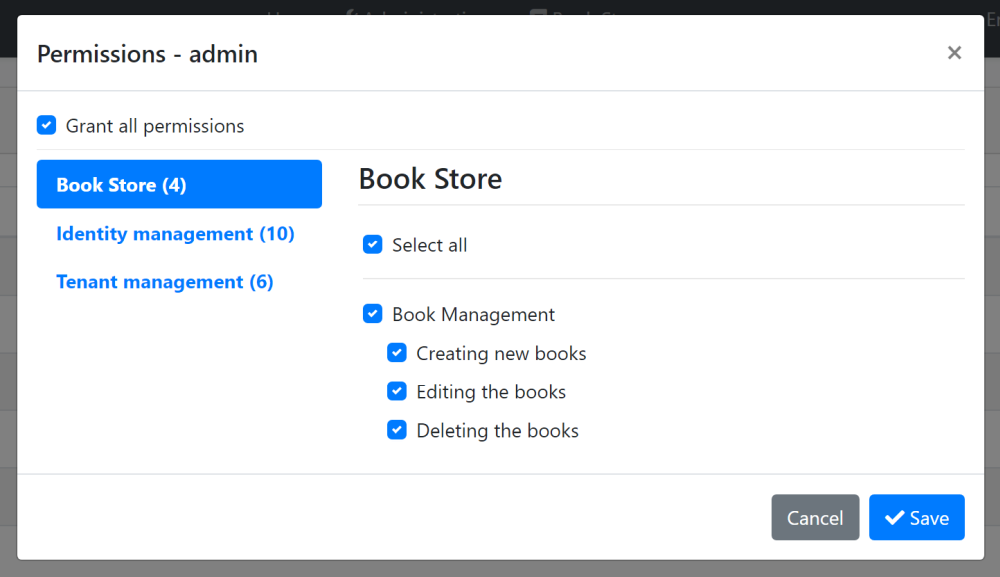

# Web Application Development Tutorial - Part 5: Authorization
````json
//[doc-params]
{
    "UI": ["MVC","NG"],
    "DB": ["EF","Mongo"]
}
````
{{
if UI == "MVC"
  UI_Text="mvc"
else if UI == "NG"
  UI_Text="angular"
else
  UI_Text="?"
end
if DB == "EF"
  DB_Text="Entity Framework Core"
else if DB == "Mongo"
  DB_Text="MongoDB"
else
  DB_Text="?"
end
}}

## About This Tutorial

In this tutorial series, you will build an ABP based web application named `Acme.BookStore`. This application is used to manage a list of books and their authors. It is developed using the following technologies:

* **{{DB_Text}}** as the ORM provider. 
* **{{UI_Value}}** as the UI Framework.

This tutorial is organized as the following parts;

- [Part 1: Creating the project and book list page](Part-1.md)
- [Part 2: The book list page](Part-2.md)
- [Part 3: Creating, updating and deleting books](Part-3.md)
- [Part 4: Integration tests](Part-4.md)
- **Part 5: Authorization (this part)**

### Download the Source Code

This tutorials has multiple versions based on your **UI** and **Database** preferences. We've prepared two combinations of the source code to be downloaded:

* [MVC (Razor Pages) UI with EF Core](https://github.com/abpframework/abp-samples/tree/master/BookStore-Mvc-EfCore)
* [Angular UI with MongoDB](https://github.com/abpframework/abp-samples/tree/master/BookStore-Angular-MongoDb)

## Permissions

ABP Framework provides an [authorization system](../Authorization.md) based on the ASP.NET Core's [authorization infrastructure](https://docs.microsoft.com/en-us/aspnet/core/security/authorization/introduction). One major feature added on top of the standard authorization infrastructure is the **permission system** which allows to define permissions and enable/disable per role, user or client.

### Permission Names

A permission must have a unique name (a `string`). The best way is to define it as a `const`, so we can reuse the permission name.

Open the `BookStorePermissions` class inside the `Acme.BookStore.Application.Contracts` project and change the content as shown below:

````csharp
namespace Acme.BookStore.Permissions
{
    public static class BookStorePermissions
    {
        public const string GroupName = "BookStore";

        public static class Books
        {
            public const string Default = GroupName + ".Books";
            public const string Create = Default + ".Create";
            public const string Edit = Default + ".Edit";
            public const string Delete = Default + ".Delete";
        }
    }
}
````

This is a hierarchical way of defining permission names. For example, "create book" permission name was defined as `BookStore.Books.Create`.

### Permission Definitions

You should define permissions before using them.

Open the `BookStorePermissionDefinitionProvider` class inside the `Acme.BookStore.Application.Contracts` project and change the content as shown below:

````csharp
using Acme.BookStore.Localization;
using Volo.Abp.Authorization.Permissions;
using Volo.Abp.Localization;

namespace Acme.BookStore.Permissions
{
    public class BookStorePermissionDefinitionProvider : PermissionDefinitionProvider
    {
        public override void Define(IPermissionDefinitionContext context)
        {
            var bookStoreGroup = context.AddGroup(BookStorePermissions.GroupName, L("Permission:BookStore"));

            var booksPermission = bookStoreGroup.AddPermission(BookStorePermissions.Books.Default, L("Permission:Books"));
            booksPermission.AddChild(BookStorePermissions.Books.Create, L("Permission:Books.Create"));
            booksPermission.AddChild(BookStorePermissions.Books.Edit, L("Permission:Books.Edit"));
            booksPermission.AddChild(BookStorePermissions.Books.Delete, L("Permission:Books.Delete"));
        }

        private static LocalizableString L(string name)
        {
            return LocalizableString.Create<BookStoreResource>(name);
        }
    }
}
````

This class defines a **permission group** (to group permissions on the UI, will be seen below) and **4 permissions** inside this group. Also, **Create**, **Edit** and **Delete** are children of the `BookStorePermissions.Books.Default` permission. A child permission can be selected **only if the parent was selected**.

Finally, edit the localization file (`en.json` under the `Localization/BookStore` folder of the `Acme.BookStore.Domain.Shared` project) to define the localization keys used above:

````json
"Permission:BookStore": "Book Store",
"Permission:Books": "Book Management",
"Permission:Books.Create": "Creating new books",
"Permission:Books.Edit": "Editing the books",
"Permission:Books.Delete": "Deleting the books"
````

> Localization key names are arbitrary and no forcing rule. But we prefer the convention used above.

### Permission Management UI

Once you define the permissions, you can see them on the **permission management modal**.

Go to the *Administration -> Identity -> Roles* page, select *Permissions* action for the admin role to open the permission management modal:



Grant the permissions you want and save the modal.

## Authorization

Now, you can use the permissions to authorize the book management.

### Application Layer & HTTP API

Open the `BookAppService` class and add set the policy names as the permission names defined above:

````csharp
using System;
using Acme.BookStore.Permissions;
using Volo.Abp.Application.Dtos;
using Volo.Abp.Application.Services;
using Volo.Abp.Domain.Repositories;

namespace Acme.BookStore.Books
{
    public class BookAppService :
        CrudAppService<
            Book, //The Book entity
            BookDto, //Used to show books
            Guid, //Primary key of the book entity
            PagedAndSortedResultRequestDto, //Used for paging/sorting
            CreateUpdateBookDto>, //Used to create/update a book
        IBookAppService //implement the IBookAppService
    {
        public BookAppService(IRepository<Book, Guid> repository)
            : base(repository)
        {
            GetPolicyName = BookStorePermissions.Books.Default;
            GetListPolicyName = BookStorePermissions.Books.Default;
            CreatePolicyName = BookStorePermissions.Books.Create;
            UpdatePolicyName = BookStorePermissions.Books.Edit;
            DeletePolicyName = BookStorePermissions.Books.Create;
        }
    }
}
````

Added code to the constructor. Base `CrudAppService` automatically uses these permissions on the CRUD operations. This makes the **application service** secure, but also makes the **HTTP API** secure since this service is automatically used as an HTTP API as explained before (see [auto API controllers](../API/Auto-API-Controllers.md)).

{{if UI == "MVC"}}

### Razor Page

While securing the HTTP API & the application service prevents unauthorized users to use the services, they can still navigate to the book management page. While they will get authorization exception when the page makes the first AJAX call to the server, we should also authorize the page for a better user experience and security.

Open the `BookStoreWebModule` and add the following code block inside the `ConfigureServices` method:

````csharp
Configure<RazorPagesOptions>(options =>
{
    options.Conventions.AuthorizePage("/Books/Index", BookStorePermissions.Books.Default);
    options.Conventions.AuthorizePage("/Books/CreateModal", BookStorePermissions.Books.Create);
    options.Conventions.AuthorizePage("/Books/EditModal", BookStorePermissions.Books.Edit);
});
````

Now, unauthorized users are redirected to the **login page**.

#### Hide the New Book Button

The book management page has a *New Book* button that should be invisible if the current user has no *Book Creation* permission.


Open the `Pages/Books/Index.cshtml` file and change the content as shown below:

````html
@page
@using Acme.BookStore.Localization
@using Acme.BookStore.Permissions
@using Acme.BookStore.Web.Pages.Books
@using Microsoft.AspNetCore.Authorization
@using Microsoft.Extensions.Localization
@model IndexModel
@inject IStringLocalizer<BookStoreResource> L
@inject IAuthorizationService AuthorizationService
@section scripts
{
    <abp-script src="/Pages/Books/Index.js"/>
}

<abp-card>
    <abp-card-header>
        <abp-row>
            <abp-column size-md="_6">
                <abp-card-title>@L["Books"]</abp-card-title>
            </abp-column>
            <abp-column size-md="_6" class="text-right">
                @if (await AuthorizationService.IsGrantedAsync(BookStorePermissions.Books.Create))
                {
                    <abp-button id="NewBookButton"
                                text="@L["NewBook"].Value"
                                icon="plus"
                                button-type="Primary"/>
                }
            </abp-column>
        </abp-row>
    </abp-card-header>
    <abp-card-body>
        <abp-table striped-rows="true" id="BooksTable"></abp-table>
    </abp-card-body>
</abp-card>
````

* Added `@inject IAuthorizationService AuthorizationService` to access to the authorization service.
* Used `@if (await AuthorizationService.IsGrantedAsync(BookStorePermissions.Books.Create))` to check the book creation permission to conditionally render the *New Book* button.

### JavaScript Side

Books table in the book management page has an actions button for each row. The actions button includes *Edit* and *Delete* action:


We should hide an action if the current user has not granted for the related permission. Datatables row actions has a `visible` option that can be set to `false` to hide the action item.

Open the `Pages/Books/Index.js` inside the `Acme.BookStore.Web` project and add a `visible` option to the `Edit` action as shown below:

````js
{
    text: l('Edit'),
    visible: abp.auth.isGranted('BookStore.Books.Edit'), //CHECK for the PERMISSION
    action: function (data) {
        editModal.open({ id: data.record.id });
    }
}
````

Do same for the `Delete` action:

````js
visible: abp.auth.isGranted('BookStore.Books.Delete')
````

* `abp.auth.isGranted(...)` is used to check a permission that is defined before.
* `visible` could also be get a function that returns a `bool` if the value will be calculated later, based on some conditions.

### Menu Item

Even we have secured all the layers of the book management page, it is still visible on the main menu of the application. We should hide the menu item if the current user has no permission.

Open the `BookStoreMenuContributor` class, find the code block below:

````csharp
context.Menu.AddItem(
    new ApplicationMenuItem(
        "BooksStore",
        l["Menu:BookStore"],
        icon: "fa fa-book"
    ).AddItem(
        new ApplicationMenuItem(
            "BooksStore.Books",
            l["Menu:Books"],
            url: "/Books"
        )
    )
);
````

And replace this code block with the following:

````csharp
var bookStoreMenu = new ApplicationMenuItem(
    "BooksStore",
    l["Menu:BookStore"],
    icon: "fa fa-book"
);

context.Menu.AddItem(bookStoreMenu);

//CHECK the PERMISSION
if (await context.IsGrantedAsync(BookStorePermissions.Books.Default))
{
    bookStoreMenu.AddItem(new ApplicationMenuItem(
        "BooksStore.Books",
        l["Menu:Books"],
        url: "/Books"
    ));
}
````

{{else if UI == "NG"}}


{{end}}