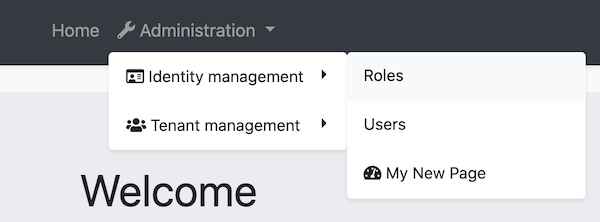
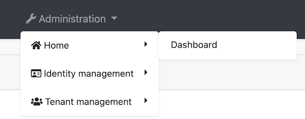

## Modifying the Menu

The menu is inside of the `ApplicationLayoutComponent` that is in the @abp/ng.theme.basic package. There are several methods to modify the menu elements. This document covers these methods. If you would like to replace all menu. Please refer to [Component Replacement documentation](./Component-Replacement.md) to learn how to replace a layout.


<!-- TODO: Replace layout replacement document with component replacement. Layout replacement document will be created.-->


### How to Add Logo

`logoUrl` property in environment is the url of the logo. 

You can add your logo to `src/assets` folder and set the `logoUrl` as shown below:

```js
export const environment = {
  // other configurations
  application: {
    name: 'MyProjectName',
    logoUrl: 'assets/logo.png',
  },
  // other configurations
};
```

### How to Add a Navigation Element

#### Via `routes` object in the `AppRoutingModule`

You can define your routes by adding the `routes` object to the `data` object of a route in the `app-routing.module`. The `@abp/ng.core` package organizes your routes and stores them in the `ConfigState`. `ApplicationLayoutComponent` gets routes and displays on the menu.

You can add `routes` object like below:

```js
import { ABP } from '@abp/ng.core';
{
// ...
  path: 'your-path',
  data: {
    routes: {
      name: 'Your navigation',
      order: 3,
      iconClass: 'fas fa-question-circle',
      requiredPolicy: 'permission key here',
      children: [
        {
          path: 'child',
          name: 'Your child navigation',
          order: 1,
          requiredPolicy: 'permission key here',
        },
      ],
    } as ABP.Route,
  }
}
```

- `name` is the label of navigation element. A localization key or localization object can be passed.
- `order` is order of the navigation element.
- `iconClass` is the class of the `i` tag, which is placed to the left of the navigation label.
- `requiredPolicy` is the permission key to access the page. See the [Permission Management document](./Permission-Management.md)
- `children` is an array that child navigation elements are able to declare. The `path` property in an element of children array will be placed as a child route. Its url will be set as `'/your-path/child'`.

After adding the routes object above, the navigation menu looks like this:


#### Via ConfigState

The `dispatchAddRoute` method of `ConfigStateService` adds a new navigation element to the menu.

```js
// this.config is instance of ConfigStateService

const newRoute: ABP.Route = {
    name: 'My New Page',
    iconClass: 'fa fa-dashboard',
    path: 'page',
    invisible: false,
    order: 2,
    requiredPolicy: 'MyProjectName.MyNewPage',
  } as Omit<ABP.Route, 'children'>;

  this.config.dispatchAddRoute(newRoute);
// returns a state stream which emits after dispatch action is complete
```

The `newRoute` will be placed as at root level, i.e. without any parent routes and its url will be stored as `'/path'`.

If you want **to add a child route, you can do this:**

```js
import { ConfigStateService } from '@abp/ng.core';
import { eIdentityRouteNames } from '@abp/ng.identity';

constructor(private config: ConfigStateService) {}

const newRoute: ABP.Route = {
  parentName: eIdentityRouteNames.IdentityManagement,
  name: 'My New Page',
  iconClass: 'fa fa-dashboard',
  path: 'page',
  invisible: false,
  order: 3,
  requiredPolicy: 'MyProjectName.MyNewPage'
} as Omit<ABP.Route, 'children'>;

this.config.dispatchAddRoute(newRoute);
// returns a state stream which emits after dispatch action is complete
```

The `newRoute` will then be placed as a child of the parent route named `eIdentityRouteNames.IdentityManagement` and its url will be set as `'/identity/page'`.

The new route will be added like below:



### How to Patch a Navigation Element

The `dispatchPatchRouteByName` finds a route by its name and replaces its configuration in the `Store` with the new configuration passed as the second parameter.

```js
import { ConfigStateService } from '@abp/ng.core';
import { eIdentityRouteNames } from '@abp/ng.identity';

constructor(private config: ConfigStateService) {}

const newRouteConfig: Partial<ABP.Route> = {
  iconClass: 'fas fa-home',
  parentName: eIdentityRouteNames.Administration,
  order: 0,
  children: [
    {
      name: 'Dashboard',
      path: 'dashboard',
    },
  ],
};

this.config.dispatchPatchRouteByName('::Menu:Home', newRouteConfig);
// returns a state stream which emits after dispatch action is complete
```

* Moved the home navigation to under the _Administration_ dropdown by passing `parentName`.
* Added an icon.
* Specified the order.
* Added a child route named _Dashboard_

After the patching above, navigation elements looks like below:




### How to Add an Element to Right Part of the Menu

The right part elements are stored in the `LayoutState` that is in the @abp/ng.theme.basic package.

The `dispatchAddNavigationElement` method of the `LayoutStateService` adds an element to the right part of the menu. 

You can add an element by adding your template to `app.component` and call the `dispatchAddNavigationElement` method:

```js
import { Layout, LayoutStateService } from '@abp/ng.theme.basic'; // added this line

@Component({
  selector: 'app-root',
  template: `
  
    <!-- Added below content -->
    <ng-template #search
      ><input type="search" placeholder="Search" class="bg-transparent border-0"
    /></ng-template>
  `,
})
export class AppComponent {
  // Added ViewChild
  @ViewChild('search', { static: false, read: TemplateRef }) searchElementRef: TemplateRef<any>;

  constructor(private layout: LayoutStateService) {} // injected LayoutStateService

// Added ngAfterViewInit
  ngAfterViewInit() {
    const newElement = {
      name: 'Search',
      element: this.searchElementRef,
      order: 1,
    } as Layout.NavigationElement;

    this.layout.dispatchAddNavigationElement(newElement);
  }
}
```

We added the search input to the menu.

The final UI looks like below:


### How to Remove an Element From Right Part of the Menu

TODO


## What's Next

* [Component Replacement](./Component-Replacement.md)