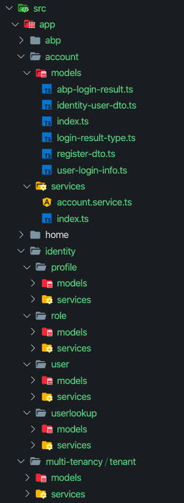

## Service Proxies

It is common to call a REST endpoint in the server from our Angular applications. In this case, we generally create **services** (those have methods for each service method on the server side) and **model objects** (matches to [DTOs](../../Data-Transfer-Objects) in the server side).

In addition to manually creating such server-interacting services, we could use tools like [NSWAG](https://github.com/RicoSuter/NSwag) to generate service proxies for us. But NSWAG has the following problems we've experienced:

* It generates a **big, single** .ts file which has some problems;
  * It get **too large** when your application grows.
  * It doesn't fit into the **[modular](../../Module-Development-Basics) approach** of the ABP framework.
* It creates a bit **ugly code**. We want to have a clean code (just like if we write manually).
* It can not generate the same **method signature** declared in the server side (because swagger.json doesn't exactly reflect the method signature of the backend service). We've created an endpoint that exposes server side method contacts to allow clients generate a better aligned client proxies.

ABP CLI `generate-proxies` command automatically generates the typescript client proxies by creating folders which separated by module names in the `src/app` folder.
Run the following command in the **root folder** of the angular application:

```bash
abp generate-proxy
```

It only creates proxies only for your own application's services. It doesn't create proxies for the services of the application modules you're using (by default). There are several options. See the [CLI documentation](../../CLI).

The files generated with the `--module all` option like below:



### Services

Each generated service matches a back-end controller. The services methods call back-end APIs via [RestService](./HTTP-Requests.md#restservice).

A variable named `apiName` (available as of v2.4) is defined in each service. `apiName` matches the module's RemoteServiceName. This variable passes to the `RestService` as a parameter at each request. If there is no microservice API defined in the environment, `RestService` uses the default. See [getting a specific API endpoint from application config](HTTP-Requests#how-to-get-a-specific-api-endpoint-from-application-config)

The `providedIn` property of the services is defined as `'root'`. Therefore no need to add a service as a provider to a module. You can use a service by injecting it into a constructor as shown below:

```js
import { AbpApplicationConfigurationService } from '../app/shared/services';

//...
export class HomeComponent{
  constructor(private appConfigService: AbpApplicationConfigurationService) {}

  ngOnInit() {
    this.appConfigService.get().subscribe()
  }
}
```

The Angular compiler removes the services that have not been injected anywhere from the final output. See the [tree-shakable providers documentation](https://angular.io/guide/dependency-injection-providers#tree-shakable-providers).

### Models

The generated models match the DTOs in the back-end. Each model is generated as a class under the `src/app/*/shared/models` folder. 

There are a few [base classes](https://github.com/abpframework/abp/blob/dev/npm/ng-packs/packages/core/src/lib/models/dtos.ts) in the `@abp/ng.core` package. Some models extend these classes.

A class instance can be created as shown below:

```js
import { IdentityRoleCreateDto } from '../identity/shared/models';
//...
const instance = new IdentityRoleCreateDto({name: 'Role 1', isDefault: false, isPublic: true})
```

Initial values ​​can optionally be passed to each class constructor.

## What's Next?

* [Http Requests](./Http-Requests.md)