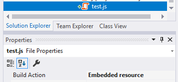

## 虚拟文件系统

虚拟文件系统使得管理物理上不存在于文件系统中(磁盘)的文件成为可能. 它主要用于将(js, css, image, cshtml ...)文件嵌入到程序集中, 并在运行时将它们象物理文件一样使用.

### Volo.Abp.VirtualFileSystem nuget包

Volo.Abp.VirtualFileSystem是虚拟文件系统的核心包. 使用程序包管理器控制台(PMC)将其安装到项目中:

```
Install-Package Volo.Abp.VirtualFileSystem
```

> 启动模板默认已经安装了此nuget包, 所以在大多数情况下你不需要手动安装它.

然后你可以在module中添加 **AbpVirtualFileSystemModule** 依赖项:

```c#
using Volo.Abp.Modularity;
using Volo.Abp.VirtualFileSystem;

namespace MyCompany.MyProject
{
    [DependsOn(typeof(AbpVirtualFileSystemModule))]
    public class MyModule : AbpModule
    {
        //...
    }
}
```

#### 注册嵌入式文件

要将文件嵌入到程序集中, 首先需要把该文件标记为嵌入式资源. 最简单的方式是在 **解决方案管理器** 中选择文件, 然后找到 **"属性"** 窗口将 **"生成操作"** 设置为 **"嵌入式资源"**.
例如:



如果需要添加多个文件, 这样做会很乏味. 作为选择， 你可以直接编辑 **.csproj** 文件:

````C#
<ItemGroup>
  <None Remove="MyResources\**\*.*" />
</ItemGroup>
````

此配置以递归方式添加项目的 **MyResources** 文件夹下的所有文件(包括将来新添加的文件).

然后需要使用 `VirtualFileSystemOptions` 来配置模块, 以便将嵌入式文件注册到虚拟文件系统.  例如:

````C#
using Microsoft.Extensions.DependencyInjection;
using Volo.Abp.Modularity;
using Volo.Abp.VirtualFileSystem;

namespace MyCompany.MyProject
{
    [DependsOn(typeof(AbpVirtualFileSystemModule))]
    public class MyModule : AbpModule
    {
        public override void ConfigureServices(ServiceConfigurationContext context)
        {
            Configure<VirtualFileSystemOptions>(options =>
            {
                //Register all embedded files of this assembly to the virtual file system
                options.FileSets.AddEmbedded<MyModule>();
            });

            //...
        }
    }
}
````

`AddEmbedded` 扩展方法需要一个类, 从给定类的程序集中查找所有嵌入文件, 并将它们注册到虚拟文件系统. 它还有更简洁的写法:

````C#
options.FileSets.Add(new EmbeddedFileSet(typeof(MyModule).Assembly));
````

#### 获取虚拟文件: IVirtualFileProvider

将文件嵌入到程序集中并注册到虚拟文件系统后, 可以使用`IVirtualFileProvider`来获取文件或目录内容:

````C#
public class MyService
{
    private readonly IVirtualFileProvider _virtualFileProvider;

    public MyService(IVirtualFileProvider virtualFileProvider)
    {
        _virtualFileProvider = virtualFileProvider;
    }

    public void Foo()
    {
        //Getting a single file
        var file = _virtualFileProvider.GetFileInfo("/MyResources/js/test.js");
        var fileContent = file.ReadAsString(); //ReadAsString is an extension method of ABP

        //Getting all files/directories under a directory
        var directoryContents = _virtualFileProvider.GetDirectoryContents("/MyResources/js");
    }
}
````

#### 在开发过程中处理嵌入式文件

将文件嵌入到模块程序集中并能够通过引用程序集(或添加nuget包)在另一个项目中使用它对于创建可重用模块非常有价值. 但是, 这使得开发模块本身变得有点困难.

假设你正在开发一个包含嵌入式JavaScript文件的模块. 当你更改文件时, 你必须重新编译项目, 重新启动应用程序并刷新浏览器页面以使更改生效. 显然, 这是非常耗时和乏味的.

我们需要的是应用程序在开发时直接使用物理文件的能力, 让浏览器刷新时同步JavaScript文件的任何更改. `ReplaceEmbeddedByPhysical` 方法使其成为可能.

下面的示例展示了应用程序依赖于包含嵌入文件的模块("MyModule"), 并且应用程序可以在开发过程中直接使用模块的源代码.

````C#
[DependsOn(typeof(MyModule))]
public class MyWebAppModule : AbpModule
{
    public override void ConfigureServices(ServiceConfigurationContext context)
    {
        var hostingEnvironment = context.Services.GetHostingEnvironment();

        if (hostingEnvironment.IsDevelopment()) //only for development time
        {
            Configure<VirtualFileSystemOptions>(options =>
            {
                //ReplaceEmbeddedByPhysical gets the root folder of the MyModule project
                options.FileSets.ReplaceEmbeddedByPhysical<MyModule>(
                    Path.Combine(hostingEnvironment.ContentRootPath, "..\\MyModuleProject")
                );
            });
        }

        //...
    }
}
````

上面的代码假设`MyWebAppModule`和`MyModule`是Visual Studio解决方案中的两个不同的项目, `MyWebAppModule`依赖于`MyModule`.

### ASP.NET Core 集成

虚拟文件系统与 ASP.NET Core 无缝集成:

* 虚拟文件可以像Web应用程序上的物理(静态)文件一样使用.
* Razor Views, Razor Pages, js, css, 图像文件和所有其他Web内容可以嵌入到程序集中并像物理文件一样使用.
* 应用程序(或其他模块)可以覆盖模块的虚拟文件, 就像将具有相同名称和扩展名的文件放入虚拟文件的同一文件夹中一样.

#### 虚拟文件中间件

虚拟文件中间件用于向客户端/浏览器提供嵌入式(js, css, image ...)文件, 就像 **wwwroot** 文件夹中的物理(静态)文件一样. 在静态文件中间件之后添加它, 如下所示:

````C#
app.UseVirtualFiles();
````

在静态文件中间件之后添加虚拟文件中间件, 使得通过在虚拟文件相同的位置放置物理文件, 从而用物理文件覆盖虚拟文件成为可能.

> 虚拟文件中间件只能虚拟wwwroot文件夹中的内容 - 就像静态文件一样.

#### Views & Pages

无需任何配置即可在应用程序中使用嵌入式的 razor Views/pages. 只需要将它们放置在要开发的模块中的标准 Views/Pages 虚拟文件夹即可.

如果模块/应用程序将新文件放置同一位置, 则会覆盖嵌入式的 Views/Pages.
